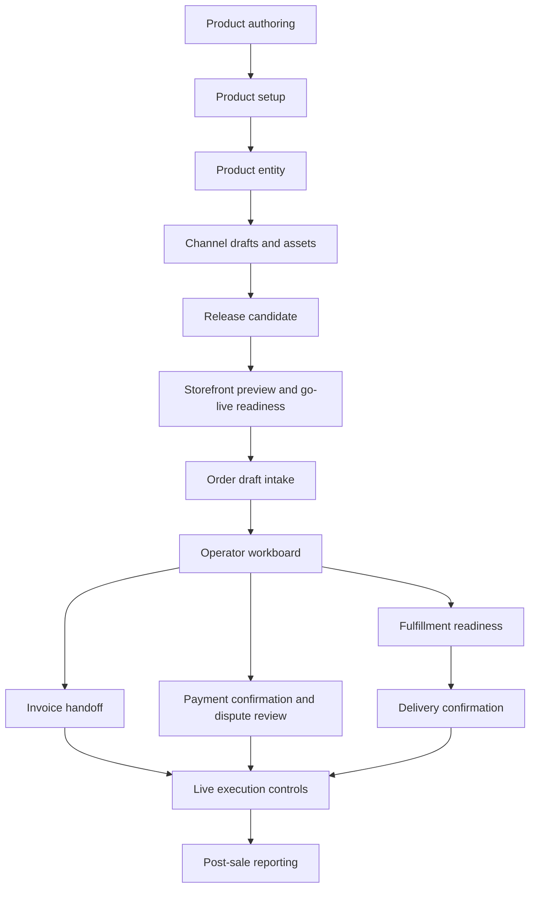

# Ecommerce Closeout

## Purpose

This closeout locks the current Ecommerce build as an MVP orchestration product.

The implemented product is an operator-assisted commerce control layer. It helps
a tenant move from product authoring to channel release, order intake, invoicing
handoff, payment review, fulfillment review, delivery confirmation, live-run
controls and post-sale reporting.

It is not yet a fully transactional commerce engine.

## Implemented narrative

## Accepted MVP boundary

The current Ecommerce product owns:

- tenant-scoped product authoring workspaces
- channel release preparation and readiness packets
- storefront preview and live-run readiness controls
- checkout/order intake surfaces
- operator workboards for order review
- invoice handoff and invoice execution completion surfaces
- payment confirmation, dispute and revenue operations workspaces
- fulfillment readiness, delivery confirmation and post-sale reporting
- operational event timelines, exception surfaces and live execution controls

The current Ecommerce product intentionally does not yet own:

- live storefront publishing to an external provider
- provider-backed checkout and payment capture
- carrier-backed shipping labels/tracking
- live inventory reservation against a stock ledger
- automatic refund/return/cancellation execution
- direct SRI submission from Ecommerce instead of Invoicing handoff

## Acceptance checklist

- product launch can be represented from draft to release readiness
- order intake can produce a tenant-scoped order draft
- an operator can inspect order readiness before handoff
- invoice handoff can be requested and tracked
- payment confirmation and dispute packets can be requested
- fulfillment readiness and delivery confirmation packets can be requested
- post-sale reporting summarizes the operational state
- live execution controls explain what is ready, blocked or future-provider
  backed
- future transactional integrations are represented as explicit boundaries, not
  hidden assumptions

## Future transactional backlog

1. Provider-backed storefront publishing
2. Payment capture provider integration
3. Shipping/tracking provider integration
4. Inventory stock ledger and reservation engine
5. Refunds, returns and cancellations with financial reconciliation
6. Ecommerce-to-Invoicing automation beyond guided handoff

## Next product bridge

Ecommerce has now pressured the right shared foundations:

- `Catalog`
- `Pricing`
- `Parties`
- `Addresses`
- `Payments`
- `Growth`
- `AI`

The next strategic pressure is `Tax Compliance EC`, but it should be preceded or
started with `Parties 2.0` because tax obligations depend on clean taxpayer and
third-party fiscal data.
