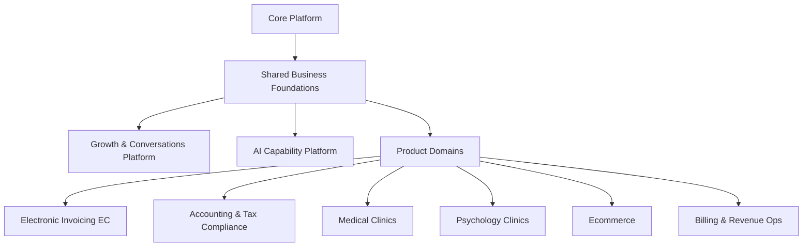

# SaaS Conceptual Model

## Purpose

This document defines the target conceptual model for the SaaS platform so the team can:

- keep one architectural map while multiple products grow
- distinguish reusable platform capabilities from product-specific domains
- plan implementation in stages based on what already exists in the repository
- avoid coupling country-specific tax flows, ecommerce, clinics, marketing, and AI into one monolith

This model is intentionally more concrete than a whiteboard vision. It is meant to guide actual repository evolution.

## Guiding principles

1. Build the platform in layers, not as a flat list of features.
2. Keep `Core Platform` independent from business products.
3. Move reusable business concepts into shared foundations instead of duplicating them inside each product.
4. Treat `Growth / WhatsApp / Funnels` and `AI` as transversal capability platforms, not as ad hoc features inside one product.
5. Let every product keep its own bounded context, rules, terminology, and workflows.
6. Sequence delivery in stages so current code is reused rather than discarded.

## Target platform map

## Target portfolio and current catalog reality

The target portfolio we want to build is:

- `Electronic Invoicing EC`
- `Accounting & Tax Compliance`
- `Medical Clinics`
- `Psychology Clinics`
- `Ecommerce`
- `Billing & Revenue Ops`

The repository catalog seed does not fully match that target yet.

### Current seeded products in the repository

Based on:

- `packages/infra/prisma/prisma/migrations/20260423190000_platform_catalog/migration.sql`

the current seeded product keys are:

- `invoicing`
- `psychology`
- `learning`
- `ecommerce`

### Practical interpretation

- `invoicing` should evolve into `Electronic Invoicing EC`
- `psychology` is already directionally aligned with `Psychology Clinics`
- `ecommerce` is already directionally aligned with the target portfolio
- `learning` is currently outside the product list we are prioritizing in this strategy
- `Accounting & Tax Compliance`, `Medical Clinics`, and `Billing & Revenue Ops` are target products, but are not yet formalized in the seeded catalog

### Recommendation

Do not force a large catalog refactor immediately.

Instead:

1. keep `invoicing` as the current product key while we evolve its semantics toward Ecuador electronic invoicing
2. keep `psychology` and `ecommerce` as valid current portfolio anchors
3. decide later whether `learning` remains part of the broader company portfolio or becomes out of scope for this roadmap
4. add `accounting`, `medical`, and `billing` to the catalog only when we are ready to start their first real slices

## Layer 1: Core Platform

This is the tenant-aware SaaS operating system. It should not know product-specific tax rules, patient flows, or ecommerce checkout details.

### Responsibilities

- users
- tenants
- memberships
- roles
- permissions
- invitations
- authentication
- current tenancy resolution
- plans
- subscriptions
- entitlements
- feature flags
- product catalog
- product access enforcement
- audit and operational hooks

### Current repository status

Already implemented in meaningful form:

- identity
- tenancy
- RBAC
- auth/session resolution
- plan and entitlement model
- feature flags
- enabled product resolution
- product/module catalog

Main current modules:

- `apps/api-platform/src/app/modules/auth/auth.module.ts`
- `apps/api-platform/src/app/modules/tenancy/tenancy.module.ts`
- `apps/api-platform/src/app/modules/commercial/commercial.module.ts`
- `apps/api-platform/src/app/modules/catalog/catalog.module.ts`
- `apps/api-platform/src/app/modules/feature-flags/feature-flags.module.ts`

## Layer 2: Shared Business Foundations

These are reusable business concepts that more than one product will need.

They are not `Core Platform`, because they are business-facing. They are not product-specific either, because they will be reused across invoicing, ecommerce, accounting, and possibly clinics.

### Recommended bounded contexts

- `Party`
  - people, companies, suppliers, customers, patients, leads
- `Address`
  - fiscal, shipping, billing, service location
- `Tax Identity`
  - country-specific taxpayer identifiers and classification
- `Catalog`
  - products, services, bundles, priceable items
- `Pricing`
  - currencies, prices, discounts, pricing rules
- `Payments`
  - payment records, payment methods, allocations, reversals
- `Numbering`
  - commercial or tax numbering sequences
- `Files & Attachments`
  - PDFs, XMLs, media, evidence, signed documents
- `Timeline / Activity`
  - user and domain activity events

### Current repository status

Partially present, but still embedded inside `Invoicing`:

- `Customer`
- `TaxRate`
- `Payment`

Current locations:

- `packages/core/invoicing/domain/src/lib/entities/customer.entity.ts`
- `packages/core/invoicing/domain/src/lib/entities/tax-rate.entity.ts`
- `packages/core/invoicing/domain/src/lib/entities/payment.entity.ts`

### Recommendation

Do not extract these immediately if it slows delivery.

Instead:

- keep them working where they are
- mark them as future candidates for extraction into shared foundations
- avoid naming or behavior that makes them impossible to reuse later

## Layer 3: Growth & Conversations Platform

This is the transversal commercial engine shared by all products.

It should not live inside `Ecommerce`, `Clinics`, or `Invoicing`.

### Responsibilities

- funnels
- landing pages
- forms
- lead capture
- lightweight CRM
- sales pipelines
- campaigns
- automations
- conversation threads
- WhatsApp integration
- templates
- assignment to human or AI agents
- attribution and conversion tracking

### Why this is transversal

All target products need some variant of:

- lead capture
- follow-up
- conversion
- reminders
- sales communication

Examples:

- `Electronic Invoicing EC`: onboarding and renewal conversations
- `Accounting & Tax Compliance`: lead nurture and declaration reminders
- `Medical Clinics`: appointment acquisition and confirmations
- `Psychology Clinics`: intake and follow-up flows
- `Ecommerce`: campaigns, abandoned cart, post-sale journeys

### Recommended future contexts

- `Growth`
- `Conversations`
- `Campaigns`
- `Automation`

## Layer 4: AI Capability Platform

This is also transversal and should not be implemented as isolated logic inside each product.

### Responsibilities

- model orchestration
- prompt registry and versioning
- retrieval and context loading
- tool calling
- permissions and data access boundaries
- audit trails of AI actions
- approval workflows for high-risk actions
- evaluation and observability
- memory scoped by tenant and domain

### Agent families on top of it

- `Tax Accountant AI`
- `Electronic Invoicing Assistant AI`
- `Medical Assistant AI`
- `Psychology Assistant AI`
- `Ecommerce Content AI`
- `Funnels / Sales AI`
- `Billing Assistant AI`

### Important rule

There should be one `AI Platform`, many specialized agents, and strict domain-scoped access.

## Product domains

## Product: Electronic Invoicing EC

This should be treated as a country-aware tax document product for Ecuador, not only as generic invoice CRUD.

### Current repository status

This is the most advanced business domain in the codebase today.

Implemented foundation:

- customers
- invoices
- invoice items
- tax rates
- invoice totals
- invoice document preview and printable HTML
- email sending
- reporting summary
- lifecycle
- payments
- partial payment reconciliation
- payment reversal support

Main current module:

- `apps/api-platform/src/app/modules/invoicing/invoicing.module.ts`

### Current scope

What exists today is already closer to:

- `Electronic Invoicing Ecuador Foundation`

than to:

- `Commercial Invoicing Core`

### Ecuador-specific capabilities already implemented

- issuer fiscal profile
  - RUC
  - razón social
  - nombre comercial
  - dirección matriz
  - ambiente y tipo de emisión
  - obligado a llevar contabilidad
  - contribuyente especial
  - RIMPE metadata when applicable
- Ecuador buyer identification semantics
  - type of identification
  - identification number
  - buyer address snapshot
- Ecuador numbering and authorization metadata
  - `codDoc`
  - `estab`
  - `ptoEmi`
  - `secuencial`
  - `claveAcceso`
  - authorization status
  - authorization number
  - authorization timestamp
- tax document structure and previews
  - `infoTributaria`
  - `infoFactura`
  - `infoNotaCredito`
  - initial `infoNotaDebito`
  - payment method nodes
  - additional information fields
- XML generation aligned to SRI semantics
- XSD validation in repo for:
  - factura (`01`)
  - nota de crédito (`04`)
  - nota de débito (`05`)
- RIDE generation and formal artifact downloads
- submission history, readiness checks, presigned XML path
- support for:
  - factura (`01`)
  - nota de crédito (`04`)
  - first debit note electronic flow (`05`)

### Ecuador-specific capabilities still missing or partial

- real XAdES/PKCS#12 signing flow inside the product runtime
- sustained remote sandbox certification flow without external signing fallback
- official local XSD bundle and submit enablement for:
  - guía de remisión (`06`)
  - comprobante de retención (`07`)
- full electronic flows for:
  - retentions
  - remisión guides
- richer debit-note operations beyond the first foundation slice

### Strategic recommendation

Treat the current implementation as a strong `Electronic Invoicing EC` foundation, but not yet as the finished country product.

## Product: Accounting & Tax Compliance

This is different from invoicing and should not be collapsed into it.

### Responsibilities

- accounting periods
- chart of accounts
- journal entries
- trial balance
- tax books
- VAT support
- income tax support
- tax reconciliations
- declaration workflows
- attachments and evidence
- filing assistance

### AI opportunities

- declaration drafting assistant
- tax review assistant
- anomaly detection
- taxpayer checklist assistant

### Current repository status

Not implemented yet as its own domain.

### Relationship to invoicing

Consumes data from:

- electronic invoices
- retentions
- payments
- customer and supplier tax identities

But remains its own product context.

## Product: Medical Clinics

### Responsibilities

- professionals
- specialties
- patients
- appointments
- schedules
- clinical encounters
- history records
- prescriptions
- reminders

### AI opportunities

- appointment assistant
- note drafting
- history summarization
- follow-up assistant

### Current repository status

Not implemented yet.

## Product: Psychology Clinics

### Responsibilities

- therapists
- patients
- sessions
- treatment tracking
- notes
- follow-up
- reminders

### AI opportunities

- appointment assistant
- structured note drafting
- session summary helper

### Current repository status

Not implemented yet.

## Product: Ecommerce

### Responsibilities

- catalog
- inventory
- storefront content
- cart
- checkout
- orders
- shipping
- payment capture
- refunds
- post-purchase communication

### AI opportunities

- landing page generation
- product copy generation
- merchandising assistant
- template generation

### Current repository status

The product exists in the catalog seed, but the domain is not implemented yet.

Catalog seed evidence:

- `packages/infra/prisma/prisma/migrations/20260423190000_platform_catalog/migration.sql`

## Product: Billing & Revenue Ops

This is the product that should carry commercial revenue operations for the SaaS itself.

It should not be confused with Ecuador electronic invoicing.

### Responsibilities

- recurring billing
- receivables
- subscription billing operations
- revenue follow-up
- dunning
- commercial invoicing for the SaaS vendor

### Why it matters

The business list originally included both:

- `facturación electrónica`
- `facturación`

Those should not stay ambiguous.

The clean split is:

- `Electronic Invoicing EC`
- `Billing & Revenue Ops`

## Current implementation snapshot

## Already present and usable

- core platform identity, tenancy, RBAC, commercial access, product catalog
- current product gating in API and web
- advanced `Invoicing` slice with lifecycle, payments, reversals, reports, notifications
- React shell with multi-slice workspace behavior

## What the repository already teaches us

The current codebase is already strong enough to guide the next stages.

### Proven in code

- multi-tenant access control works
- product catalog and product gating work
- frontend and backend can cooperate around enabled products
- one business domain can grow in slices without breaking the platform
- release/versioning flow is already established for `api-platform`

### Proven by version history

Current backend version:

- `apps/api-platform/package.json` -> `0.16.0`

Recent product evolution in `main`:

- `37807f0` first invoicing foundation
- `92b8100` taxes, documents, notifications, reports, lifecycle, payments
- `41da065` payment reconciliation and reversals
- `114e686` release cut to `0.16.0`

### Important consequence

We should not restart the model from scratch.

We should use the current repository as:

- the real `Stage 0` and `Stage 1` baseline
- the foundation for `Electronic Invoicing EC`
- the eventual teaching ground for shared foundations extraction

## Present in catalog but not implemented as domain

- `ecommerce`
- `psychology`
- `learning`

## Not implemented yet

- shared business foundations as their own bounded contexts
- growth platform
- conversations / WhatsApp platform
- AI capability platform
- accounting and tax compliance
- clinics

## Recommended staged roadmap

## Stage 0: Platform baseline

### Goal

Build the SaaS operating system and access model.

### Status

Substantially done.

### Included

- auth
- tenancy
- RBAC
- subscriptions
- entitlements
- feature flags
- product catalog

## Stage 1: Invoicing commercial core

### Goal

Prove one real business domain end to end.

### Status

Done and already advanced in the repository.

### Included

- customers
- invoices
- items
- taxes
- reports
- payments
- reversals
- document preview
- notifications

## Stage 2: Electronic Invoicing Ecuador MVP

### Goal

Convert current invoicing into a real Ecuador-compliant electronic invoicing product.

### Recommended slices

1. issuer tax profile
2. Ecuador numbering model
3. Ecuador buyer identification model
4. SRI XML generation
5. signature integration
6. SRI authorization workflow
7. RIDE generation
8. authorization status tracking

### Current progress snapshot

- slices `1` to `8` are already represented for invoice `01`
- credit note `04` already has numbering, draft flow, XML preview, RIDE, XSD validation, and submit path
- debit note `05` already has numbering, draft flow, XML preview, RIDE, XSD validation, and submit path
- withholding certificate `07` already has numbering, draft flow, XML preview, RIDE, XSD validation, and submit path

### Why this is next

It leverages current work directly and turns `Invoicing` into a stronger, country-aware product.

### Concrete repository implication

This stage should happen mainly by evolving:

- `apps/api-platform/src/app/modules/invoicing`
- `packages/core/invoicing/domain`
- `packages/core/invoicing/application`
- `packages/infra/prisma/src/lib/invoicing`
- `apps/web-platform/src/app`

## Stage 3: Shared foundations extraction

### Goal

Extract reusable business concepts once at least two products need them.

### Candidates

- `Customer` to `Party`
- `TaxRate` to `TaxRule`
- `Payment` to shared payments context
- basic addresses and tax identities

### Important note

Do not extract too early if it slows product delivery.

## Stage 4: Growth & Conversations Platform

### Goal

Create the transversal commercial engine used by all products.

### Recommended slices

1. lead capture
2. pipeline
3. WhatsApp conversation inbox
4. message templates
5. funnel pages
6. automations

### Important timing note

This platform is transversal, but we do not need to build all of it before the next product.

The healthiest sequence is:

- first mature `Electronic Invoicing EC`
- then introduce the first reusable `Growth` slices
- then let `Ecommerce` and `Clinics` consume them

## Stage 5: AI Capability Platform

### Goal

Build one transversal AI runtime for domain-specific assistants.

### Recommended slices

1. AI runtime and prompt registry
2. tenant-scoped retrieval
3. tool access model
4. audit and approval flows
5. first agent for invoicing/tax tasks

## Stage 6: Ecommerce

### Goal

Launch the next major product on top of the existing platform and shared foundations.

### Recommended slices

1. catalog domain
2. storefront basics
3. cart and checkout
4. orders
5. post-purchase communication
6. AI content helper

### Why this is the next major product after Ecuador invoicing

`Ecommerce` will pressure exactly the right shared foundations:

- catalog
- pricing
- customers / parties
- addresses
- payments
- growth flows

That makes it the best second major product for validating the multi-product architecture.

## Stage 7: Accounting & Tax Compliance

### Goal

Turn invoices, retentions, and payments into formal accounting and declaration workflows.

### Recommended slices

1. tax books
2. declaration preparation
3. supporting evidence and workflow
4. AI tax accountant assistant

## Stage 8: Clinics products

### Goal

Use the common platform, growth, conversations, and AI capabilities for vertical service businesses.

### Recommended order

1. Medical Clinics
2. Psychology Clinics

## Practical delivery rules

1. New cross-product logic should first be evaluated as `Shared Foundation`, `Growth`, or `AI Platform` before being placed inside a product.
2. Country-specific tax document behavior should stay inside `Electronic Invoicing EC`, not in shared billing foundations.
3. Product-specific AI should be implemented as agents over a common AI platform, not as isolated one-off integrations.
4. `Ecommerce` should be the next large product domain after the Ecuador invoicing MVP is shaped enough to teach the platform how to handle shared foundations.
5. `Accounting & Tax Compliance` should consume invoicing outputs but remain an independent product.

## Immediate next recommendation

Given the current repository state, the best next strategic step is:

1. keep extending `Electronic Invoicing EC` document-by-document inside the existing invoicing domain
2. keep `05` on the same testing and hardening rail as `01` and `04`
3. then choose between retentions (`07`) or remisión guides (`06`) as the next country-specific document
4. keep `Ecommerce` as the next major product domain only after this Ecuador MVP teaches enough about shared foundations

That path keeps momentum, preserves current work, and gives the platform a much clearer multi-product context.

## Near-term execution plan

If we want to keep the roadmap practical, the next implementation sequence should be:

1. `Electronic Invoicing EC`
   - invoice (`01`) already mature
   - credit note (`04`) already on the electronic rail
   - debit note (`05`) already on the electronic rail
2. `Electronic Invoicing EC` compliance flow
   - strengthen signature
   - complete remote sandbox behavior
   - continue document bundle coverage for `06` and `07`
3. first shared foundation pressure review
   - decide whether `Customer`, `Payment`, and `TaxRate` should still stay inside `Invoicing`
4. first `Growth & Conversations` slice
   - lead capture plus WhatsApp inbox
5. `Ecommerce` first domain slice
   - catalog plus orders

This keeps the architecture grounded in what the repository already knows how to do instead of jumping too early into broad abstractions.
