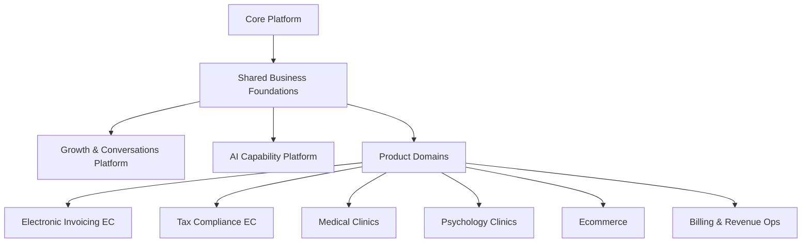
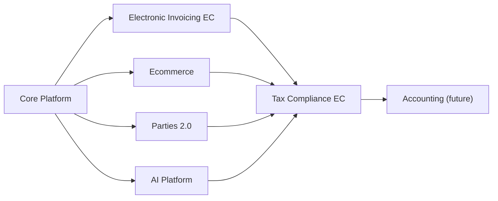

# SaaS Conceptual Model

## Purpose

This document defines the target conceptual model for the SaaS platform so the team can:

- keep one architectural map while multiple products grow
- distinguish reusable platform capabilities from product-specific domains
- plan implementation in stages based on what already exists in the repository
- avoid coupling country-specific tax flows, ecommerce, clinics, marketing, and AI into one monolith

This model is intentionally more concrete than a whiteboard vision. It is meant to guide actual repository evolution.

## Guiding principles

1. Build the platform in layers, not as a flat list of features.
2. Keep `Core Platform` independent from business products.
3. Move reusable business concepts into shared foundations instead of duplicating them inside each product.
4. Treat `Growth / WhatsApp / Funnels` and `AI` as transversal capability platforms, not as ad hoc features inside one product.
5. Let every product keep its own bounded context, rules, terminology, and workflows.
6. Sequence delivery in stages so current code is reused rather than discarded.

## Target platform map

## Target portfolio and current catalog reality

The target portfolio we want to build is:

- `Electronic Invoicing EC`
- `Tax Compliance EC`
- `Medical Clinics`
- `Psychology Clinics`
- `Ecommerce`
- `Billing & Revenue Ops`

The repository catalog seed does not fully match that target yet.

### Current seeded products in the repository

Based on:

- `packages/infra/prisma/prisma/migrations/20260423190000_platform_catalog/migration.sql`
- `packages/infra/prisma/prisma/migrations/20260605100000_tax_compliance_product_catalog/migration.sql`

the current seeded product keys are:

- `invoicing`
- `tax-compliance-ec`
- `psychology`
- `learning`
- `ecommerce`

### Practical interpretation

- `invoicing` should evolve into `Electronic Invoicing EC`
- `tax-compliance-ec` is now the formal product anchor for Ecuador tax obligations, evidence, review packets, closeout, and external filing/payment handoff
- `psychology` is already directionally aligned with `Psychology Clinics`
- `ecommerce` is already directionally aligned with the target portfolio
- `learning` is currently outside the product list we are prioritizing in this strategy
- `Medical Clinics` and `Billing & Revenue Ops` are target products, but are not yet formalized in the seeded catalog
- `Accounting` remains a future product candidate. Tax Compliance EC now exposes an accounting bridge mapping, but it intentionally stops before chart-of-accounts ownership, journals, ledgers, balances, or formal accounting close

### Recommendation

Do not force a large catalog refactor immediately.

Instead:

1. keep `invoicing` as the current product key while we evolve its semantics toward Ecuador electronic invoicing
2. keep `psychology` and `ecommerce` as valid current portfolio anchors
3. decide later whether `learning` remains part of the broader company portfolio or becomes out of scope for this roadmap
4. add `accounting`, `medical`, and `billing` to the catalog only when we are ready to start their first real slices
5. keep Parties 2.0 as the shared fiscal directory foundation for Tax Compliance EC, Ecommerce, Invoicing, and the future Accounting product

## Layer 1: Core Platform

This is the tenant-aware SaaS operating system. It should not know product-specific tax rules, patient flows, or ecommerce checkout details.

### Responsibilities

- users
- tenants
- memberships
- roles
- permissions
- invitations
- authentication
- current tenancy resolution
- plans
- subscriptions
- entitlements
- feature flags
- product catalog
- product access enforcement
- audit and operational hooks

### Current repository status

Already implemented in meaningful form:

- identity
- tenancy
- RBAC
- auth/session resolution
- plan and entitlement model
- feature flags
- enabled product resolution
- product/module catalog

Main current modules:

- `apps/api-platform/src/app/modules/auth/auth.module.ts`
- `apps/api-platform/src/app/modules/tenancy/tenancy.module.ts`
- `apps/api-platform/src/app/modules/commercial/commercial.module.ts`
- `apps/api-platform/src/app/modules/catalog/catalog.module.ts`
- `apps/api-platform/src/app/modules/feature-flags/feature-flags.module.ts`

## Layer 2: Shared Business Foundations

These are reusable business concepts that more than one product will need.

They are not `Core Platform`, because they are business-facing. They are not product-specific either, because they will be reused across invoicing, ecommerce, accounting, and possibly clinics.

### Recommended bounded contexts

- `Party`
  - people, companies, suppliers, customers, patients, leads
- `Address`
  - fiscal, shipping, billing, service location
- `Tax Identity`
  - country-specific taxpayer identifiers and classification
- `Catalog`
  - products, services, bundles, priceable items
- `Pricing`
  - currencies, prices, discounts, pricing rules
- `Payments`
  - payment records, payment methods, allocations, reversals
- `Numbering`
  - commercial or tax numbering sequences
- `Files & Attachments`
  - PDFs, XMLs, media, evidence, signed documents
- `Timeline / Activity`
  - user and domain activity events

### Current repository status

Partially present, but still embedded inside `Invoicing`:

- `Customer`
- `TaxRate`
- `Payment`
- first read-only `Party` directory already exists as a shared facade backed by `Customer`

Current locations:

- `packages/core/invoicing/domain/src/lib/entities/customer.entity.ts`
- `packages/core/invoicing/domain/src/lib/entities/tax-rate.entity.ts`
- `packages/core/invoicing/domain/src/lib/entities/payment.entity.ts`
- `packages/core/parties/domain`
- `packages/core/parties/application`
- `apps/api-platform/src/app/modules/parties`

### Recommendation

Do not extract these immediately if it slows delivery.

Instead:

- keep them working where they are
- mark them as future candidates for extraction into shared foundations
- avoid naming or behavior that makes them impossible to reuse later
- use small read models like `Party` to prove the extraction path before moving persistence or write workflows

## Layer 3: Growth & Conversations Platform

This is the transversal commercial engine shared by all products.

It should not live inside `Ecommerce`, `Clinics`, or `Invoicing`.

### Responsibilities

- funnels
- landing pages
- forms
- lead capture
- lightweight CRM
- sales pipelines
- campaigns
- automations
- conversation threads
- WhatsApp integration
- templates
- assignment to human or AI agents
- attribution and conversion tracking

### Why this is transversal

All target products need some variant of:

- lead capture
- follow-up
- conversion
- reminders
- sales communication

Examples:

- `Electronic Invoicing EC`: onboarding and renewal conversations
- `Tax Compliance EC`: lead nurture and declaration reminders
- `Medical Clinics`: appointment acquisition and confirmations
- `Psychology Clinics`: intake and follow-up flows
- `Ecommerce`: campaigns, abandoned cart, post-sale journeys

### Recommended future contexts

- `Growth`
- `Conversations`
- `Campaigns`
- `Automation`

## Layer 4: AI Capability Platform

This is also transversal and should not be implemented as isolated logic inside each product.

### Responsibilities

- model orchestration
- prompt registry and versioning
- retrieval and context loading
- AI-ready context contracts exposed by each domain before model logic is added
- tool calling
- permissions and data access boundaries
- audit trails of AI actions
- approval workflows for high-risk actions
- evaluation and observability
- memory scoped by tenant and domain
- suggestion mode versus execution mode, with explicit guardrails between them

### Required platform pattern

Every product should expose deterministic, domain-owned surfaces first, and the AI platform should consume those surfaces rather than bypass them.

Examples:

- `Growth` can expose a guided agenda contract with tasks, reply suggestions, next actions, warmth hints, and playbooks
- `Electronic Invoicing EC` can expose drafting, review, and checklist surfaces for tax documents
- `Ecommerce` can expose product, catalog, landing, and campaign context surfaces

That means:

- prompts should not become the hidden source of truth for domain logic
- the domain still owns business rules, approvals, and workflow state
- the AI platform sits above those contracts to suggest, explain, draft, or automate within explicit boundaries

### Agent families on top of it

- `Tax Accountant AI`
- `Electronic Invoicing Assistant AI`
- `Medical Assistant AI`
- `Psychology Assistant AI`
- `Ecommerce Content AI`
- `Funnels / Sales AI`
- `Billing Assistant AI`

### Important rule

There should be one `AI Platform`, many specialized agents, and strict domain-scoped access.

The AI platform is not the same thing as a product-specific guided UI.

For example:

- `Growth Assist` is a product/workspace surface
- future `Growth AI` capabilities should plug into that surface through the transversal AI platform
- the same pattern should hold for invoicing, ecommerce, and future vertical products

## Product domains

## Product: Electronic Invoicing EC

This should be treated as a country-aware tax document product for Ecuador, not only as generic invoice CRUD.

### Current repository status

This is the most advanced business domain in the codebase today.

Implemented foundation:

- customers
- invoices
- invoice items
- tax rates
- invoice totals
- invoice document preview and printable HTML
- email sending
- reporting summary
- lifecycle
- payments
- partial payment reconciliation
- payment reversal support

Main current module:

- `apps/api-platform/src/app/modules/invoicing/invoicing.module.ts`

### Current scope

What exists today is already closer to:

- `Electronic Invoicing Ecuador Foundation`

than to:

- `Commercial Invoicing Core`

### Ecuador-specific capabilities already implemented

- issuer fiscal profile
  - RUC
  - razón social
  - nombre comercial
  - dirección matriz
  - ambiente y tipo de emisión
  - obligado a llevar contabilidad
  - contribuyente especial
  - RIMPE metadata when applicable
- Ecuador buyer identification semantics
  - type of identification
  - identification number
  - buyer address snapshot
- Ecuador numbering and authorization metadata
  - `codDoc`
  - `estab`
  - `ptoEmi`
  - `secuencial`
  - `claveAcceso`
  - authorization status
  - authorization number
  - authorization timestamp
- tax document structure and previews
  - `infoTributaria`
  - `infoFactura`
  - `infoNotaCredito`
  - `infoNotaDebito`
  - `infoGuiaRemision`
  - `infoCompRetencion`
  - payment method nodes
  - additional information fields
- XML generation aligned to SRI semantics
- XSD validation in repo for:
  - factura (`01`)
  - nota de crédito (`04`)
  - nota de débito (`05`)
  - guía de remisión (`06`)
  - comprobante de retención (`07`)
- RIDE generation and formal artifact downloads
- submission history, readiness checks, presigned XML path
- support for:
  - factura (`01`)
  - nota de crédito (`04`)
  - nota de débito (`05`)
  - guía de remisión (`06`)
  - comprobante de retención (`07`)

### Ecuador-specific capabilities still missing or partial

- remote sandbox onboarding still needs smoother tenant bootstrap ergonomics
- the internal PKCS#12 signer is already much stronger, but still needs sustained CELCER validation with a sandbox-enabled taxpayer
- remote sandbox rollout still depends on real issuer-certificate alignment, not just local fixtures
- richer debit-note and withholding operations can still grow beyond the current electronic baseline

### Strategic recommendation

Treat the current implementation as a strong `Electronic Invoicing EC` foundation, but not yet as the finished country product.

## Product: Tax Compliance EC

This is different from invoicing and should not be collapsed into it.

It should start as an Ecuador tax compliance product for operational tax
obligations, not as a full accounting suite. The first useful product is the
control room that turns invoices, retentions, ecommerce activity, parties and
periods into "what must be reviewed, prepared, explained, and handed to a human
accountant when needed".

### Responsibilities

- VAT support
- income tax support
- tax periods
- tax obligation calendar
- taxpayer profile
- obligation readiness checks
- SRI fiscal evidence intake for received and issued vouchers
- tax books
- tax reconciliations
- declaration workflows
- declaration form draft packets
- attachments and evidence
- filing assistance
- accountant review packets

### AI opportunities

- declaration drafting assistant
- tax review assistant
- assisted SRI form walkthroughs
- anomaly detection
- taxpayer checklist assistant

### Current repository status

Implemented as the `tax-compliance-ec` product anchor with its own access
permissions, Ecuador tax period workspaces, obligation settings, due monitors,
VAT/income tax/withholding readiness, purchase evidence, evidence vault,
annexes readiness, accountant review packets, operational closeout, external
filing/payment handoff, accounting bridge mapping, Growth reminder packets, and
a transversal AI review assistant template.

Backlog: extend this product with a taxpayer-controlled SRI fiscal evidence
intake and assisted declaration preparation lane. The first version should allow
operators to import SRI reports/XML for issued and received electronic vouchers,
normalize that evidence into a fiscal evidence store, reconcile it against
Invoicing, Ecommerce, purchases, withholdings, and Parties, and then prepare
declaration draft packets for supported SRI forms. The product may suggest form
box values, show the evidence behind each value, explain the step-by-step SRI
online filing path, and generate XML/JSON/Excel artifacts only where the SRI
publishes compatible formats. It must not store SRI credentials, bypass
recaptcha, submit declarations, sign forms, or pay taxes automatically.

### Relationship to invoicing

Consumes data from:

- electronic invoices
- retentions
- payments
- customer and supplier tax identities

But remains its own product context.

### Boundary with accounting

`Tax Compliance EC` should not pretend to be full accounting at the beginning.

Full accounting is a later and heavier product context, responsible for:

- chart of accounts
- journal entries
- ledgers
- trial balance
- bank reconciliation
- financial statements
- deeper accountant workflows

The recommended sequence is:

1. build `Tax Compliance EC` first around tax obligations, periods, readiness,
   evidence and accountant handoff
2. use that product to learn which customers need formal accounting depth
3. only then graduate the heavier `Accounting` product when the platform has
   enough demand and shared foundations to justify it

The current bridge to that future product is an accounting readiness packet:
Tax Compliance EC can recommend whether a tenant should stay inside the tax
control room or graduate into `Accounting`, but it still does not own chart of
accounts, journals, ledgers, trial balance, bank reconciliation, or financial
statements.

## Product: Medical Clinics

### Responsibilities

- professionals
- specialties
- patients
- appointments
- schedules
- clinical encounters
- history records
- prescriptions
- reminders

### AI opportunities

- appointment assistant
- note drafting
- history summarization
- follow-up assistant

### Current repository status

Not implemented yet.

## Product: Psychology Clinics

### Responsibilities

- therapists
- patients
- sessions
- treatment tracking
- notes
- follow-up
- reminders

### AI opportunities

- appointment assistant
- structured note drafting
- session summary helper

### Current repository status

Not implemented yet.

## Product: Ecommerce

### Responsibilities

- catalog
- inventory
- storefront content
- cart
- checkout
- orders
- shipping
- payment capture
- refunds
- post-purchase communication

### AI opportunities

- landing page generation
- product copy generation
- merchandising assistant
- template generation

### Current repository status

The product has moved past catalog seed status and now exists as an implemented
domain slice.

Implemented surfaces include:

- product authoring, product setup, product entities, channel drafts, channel
  assets and release candidates
- storefront preview, go-live readiness and live storefront session workspaces
- checkout customer capture, order draft persistence and order operator boards
- invoice handoff, payment confirmation, dispute handling, fulfillment
  readiness, delivery confirmation and post-sale reporting
- web clients, Nest API surfaces, Prisma repositories and ecommerce closeout
  smokes

Current persistence foundation:

- product drafts
- product setups
- product entities
- product entity channel drafts
- order drafts

Current boundary:

Ecommerce is still an operator-assisted commerce domain, not a full
transactional commerce engine. Payments, shipping, refunds, inventory stock and
carrier/provider integrations are represented as readiness/workspace/packet
surfaces before live external execution is introduced.

### Closeout backlog

Ecommerce is now mature enough to close as an MVP orchestration product before
opening the next major domain.

The remaining closeout work should stay small and documentary:

- publish a clear Ecommerce closeout report
- document the implemented operator-assisted commerce model
- capture the end-to-end flow from launch to post-sale live execution
- preserve the known boundary between readiness/workspace/packet surfaces and
  future live external execution
- keep a short backlog of future transactional integrations:
  - live storefront publish
  - provider-backed checkout and payment capture
  - carrier-backed shipping/tracking
  - live inventory reservations
  - refunds, returns and cancellations

This closeout should not become another expansion slice unless it reveals a
blocking gap in the current implemented flow.

## Strategic Product Backlog

The current platform history suggests this product order:

1. `Parties 2.0`
   - status: foundation closeout in progress
   - purpose: turn the first party directory into a stronger fiscal/customer/
     supplier foundation
   - output: fiscal third-party profiles, customer/supplier role bridge,
     duplicate/merge readiness, supplier/customer declaration readiness,
     closeout pack and smoke narrative
   - reason: `Tax Compliance EC` depends heavily on reliable third-party fiscal
     data
2. `Tax Compliance EC hardening`
   - status: active product already built, next hardening candidate after
     Parties 2.0 closeout
   - purpose: keep improving Ecuador tax obligations like VAT, income tax,
     retentions, period readiness, evidence quality and accountant review
   - output: stronger SRI evidence intake, declaration artifacts, quality
     center and accountant collaboration loops
   - reason: now consumes `Invoicing`, `Ecommerce`, `Parties`, `Growth`, `AI`
     and Accounting Foundation
3. `Accounting Advanced`
   - status: future candidate, not automatic
   - purpose: graduate from foundation accounting only when tenants need formal
     books, certified bank feeds, ledger-grade controls or accountant-owned
     closeout
   - output: official books, bank statement certification, advanced closeout
     and professional accounting workspaces
   - reason: should be opened only when Tax Compliance and Parties surface gaps
     that cannot be handled by assisted tax workflows

### Product decision

`Parties 2.0` is the current enabling foundation closeout. Once its fiscal
directory, role bridge, duplicate readiness and closeout pack are stable, the
recommended next step is to return to `Tax Compliance EC` hardening rather than
opening `Accounting Advanced` by default.

The product should support businesses that can self-serve tax readiness, while
also recognizing that larger or more complex taxpayers will need a human
accountant. The right product shape is not "replace the accountant"; it is:

- prepare clean evidence
- explain the obligation status
- surface missing data
- package declaration inputs
- let the accountant review, correct and approve

That gives small businesses value early and gives larger businesses a safer
bridge into a future accounting product.

## Product: Billing & Revenue Ops

This is the product that should carry commercial revenue operations for the SaaS itself.

It should not be confused with Ecuador electronic invoicing.

### Responsibilities

- recurring billing
- receivables
- subscription billing operations
- revenue follow-up
- dunning
- commercial invoicing for the SaaS vendor

### Why it matters

The business list originally included both:

- `facturación electrónica`
- `facturación`

Those should not stay ambiguous.

The clean split is:

- `Electronic Invoicing EC`
- `Billing & Revenue Ops`

## Current implementation snapshot

## Already present and usable

- core platform identity, tenancy, RBAC, commercial access, product catalog
- current product gating in API and web
- advanced `Invoicing` slice with lifecycle, payments, reversals, reports, notifications
- React shell with multi-slice workspace behavior

## What the repository already teaches us

The current codebase is already strong enough to guide the next stages.

### Proven in code

- multi-tenant access control works
- product catalog and product gating work
- frontend and backend can cooperate around enabled products
- one business domain can grow in slices without breaking the platform
- release/versioning flow is already established for `api-platform`

### Proven by version history

Current backend version:

- `apps/api-platform/package.json` -> `0.16.0`

Recent product evolution in `main`:

- `37807f0` first invoicing foundation
- `92b8100` taxes, documents, notifications, reports, lifecycle, payments
- `41da065` payment reconciliation and reversals
- `114e686` release cut to `0.16.0`

### Important consequence

We should not restart the model from scratch.

We should use the current repository as:

- the real `Stage 0` and `Stage 1` baseline
- the foundation for `Electronic Invoicing EC`
- the eventual teaching ground for shared foundations extraction

## Present in catalog but not implemented as domain

- `ecommerce`
- `psychology`
- `learning`

## Not implemented yet

- shared business foundations as their own bounded contexts
- growth platform
- conversations / WhatsApp platform
- AI capability platform
- accounting and tax compliance
- clinics

## Recommended staged roadmap

## Stage 0: Platform baseline

### Goal

Build the SaaS operating system and access model.

### Status

Substantially done.

### Included

- auth
- tenancy
- RBAC
- subscriptions
- entitlements
- feature flags
- product catalog

## Stage 1: Invoicing commercial core

### Goal

Prove one real business domain end to end.

### Status

Done and already advanced in the repository.

### Included

- customers
- invoices
- items
- taxes
- reports
- payments
- reversals
- document preview
- notifications

## Stage 2: Electronic Invoicing Ecuador MVP

### Goal

Convert current invoicing into a real Ecuador-compliant electronic invoicing product.

### Recommended slices

1. issuer tax profile
2. Ecuador numbering model
3. Ecuador buyer identification model
4. SRI XML generation
5. signature integration
6. SRI authorization workflow
7. RIDE generation
8. authorization status tracking

### Current progress snapshot

- slices `1` to `8` are already represented for invoice `01`
- credit note `04` already has numbering, draft flow, XML preview, RIDE, XSD validation, and submit path
- debit note `05` already has numbering, draft flow, XML preview, RIDE, XSD validation, and submit path
- remission guide `06` already has numbering, draft flow, XML preview, RIDE, XSD validation, and submit path
- withholding certificate `07` already has numbering, draft flow, XML preview, RIDE, XSD validation, and submit path
- the next Ecuador gap is no longer document coverage but compliance hardening around signer capability and remote sandbox behavior
- readiness now distinguishes `local stub`, `remote presigned`, and `remote internal signer`
- internal PKCS#12 material now has an OpenSSL-backed probe so the product can tell when signer secrets merely exist versus when the keystore can actually be opened and inspected
- signer inspection now also extracts certificate metadata and vigencia so the remote internal path can warn on upcoming expiry or block expired certificates
- signer inspection now also runs a cryptographic proof with the private key so the product can distinguish “keystore opens” from “private key is actually operable”
- readiness now also includes a local offline-compatibility probe so the product can tell when the internal signer already produces signed XML that passes structural offline checks plus local XSD validation for Ecuador document flows

### Why this is next

It leverages current work directly and turns `Invoicing` into a stronger, country-aware product.

### Concrete repository implication

This stage should happen mainly by evolving:

- `apps/api-platform/src/app/modules/invoicing`
- `packages/core/invoicing/domain`
- `packages/core/invoicing/application`
- `packages/infra/prisma/src/lib/invoicing`
- `apps/web-platform/src/app`

## Stage 3: Shared foundations extraction

### Goal

Extract reusable business concepts once at least two products need them.

### Candidates

- `Customer` to `Party`
- `TaxRate` to `TaxRule`
- `Payment` to shared payments context
- basic addresses and tax identities

### Important note

Do not extract too early if it slows product delivery.

### Current practical state

The repository already has the first safe pressure test of this stage:

- a read-only `Party` directory backed by `Invoicing.Customer`
- no persistence split yet
- no write workflow migration yet

This is intentional. It gives the platform a reusable business surface without forcing a premature data migration.

## Stage 4: Growth & Conversations Platform

### Goal

Create the transversal commercial engine used by all products.

### Recommended slices

1. lead capture
2. conversation thread foundation
3. pipeline
4. WhatsApp conversation inbox
5. message templates
6. funnel pages
7. automations

### Important timing note

This platform is transversal, but we do not need to build all of it before the next product.

The healthiest sequence is:

- first mature `Electronic Invoicing EC`
- then introduce the first reusable `Growth` slices
- then let `Ecommerce` and `Clinics` consume them

## Stage 5: AI Capability Platform

### Goal

Build one transversal AI runtime for domain-specific assistants.

### First slice now grounded in the repo

- the first transversal slice should not begin with direct model execution
- it should begin by making the platform explicit and auditable:
  - a transversal `AI` module
  - an agent catalog
  - a prompt registry with visible versioning
  - tenant/domain-scoped suggestion envelopes
  - a first consumer that still stays in `suggestion` mode
- that first slice now has a natural starting point in the repository:
  - `GET /api/ai/agents`
  - `GET /api/ai/prompts`
  - `GET /api/ai/agents/:agentKey/prompt-pack`
  - `GET /api/ai/tenants/:slug/agents/growth-assist-coach/suggestion-envelope`
- the first real consumer should be `Growth Assist`, but only as a surface:
  - the AI layer consumes `growth.assist.daily_agenda`
  - it does not become the new source of truth for Growth
  - it does not send messages or mutate workflow state automatically
  - it prepares a constrained, auditable handoff for future model-backed suggestions
- the next grounded step after envelopes and prompt packs is an auditable run history:
  - `POST /api/ai/tenants/:slug/agents/:agentKey/suggestion-runs`
  - `GET /api/ai/tenants/:slug/agents/:agentKey/suggestion-runs`
  - this gives the transversal AI platform memory of who prepared a suggestion handoff, when, for which tenant, and with which prompt-pack version
  - that history should exist before any guarded execution path is introduced

### Recommended slices

1. AI runtime and prompt registry
2. tenant-scoped retrieval
3. AI-ready domain contract review
4. tool access model
   - expose a transversal tool registry
   - expose per-agent tool access rules
   - make envelopes explicit about which tools are allowed, which need approval, and which are blocked
   - keep execution tools blocked until approval and guarded-execution flows exist
5. audit and approval flows
   - the first approval slice can stay in `suggestion mode`
   - it should approve or reject auditable suggestion handoffs before any guarded execution path exists
   - approval memory should be tenant-scoped, agent-scoped, and attached to concrete run history
   - that keeps the human review loop explicit before the platform starts unlocking higher-risk execution tools
6. first agent for invoicing/tax tasks
   - expose an AI-ready deterministic surface from invoicing first:
     - `GET /api/invoicing/tenants/:slug/assist/document-drafting`
   - then let `invoice-document-assistant` become the second `ready` agent in suggestion mode
   - the agent should explain checklist gaps, drafting order, and blocked actions
   - it must not sign, submit, authorize, or claim fiscal validity automatically
7. first suggestion-mode agent for Growth Assist surfaces

### Suggested delivery discipline

- first expose deterministic domain contracts that AI can consume
- then add AI suggestion mode on top of those contracts
- then add human approval loops on top of auditable suggestion runs
- only after observability and approval flows exist should the platform move from suggestions into guarded execution

## Stage 6: Ecommerce

### Goal

Launch the next major product on top of the existing platform and shared foundations.

### Recommended slices

1. keep the conceptual map aligned with the implemented ecommerce domain
2. complete editable order buyer/fiscal profile operations
3. add fulfillment and inventory availability foundations
4. introduce real stock/capacity reservations on product entities
5. introduce provider-backed payment capture and reconciliation
6. introduce refunds, returns and cancellation operations
7. add shipping/tracking provider handoffs
8. add AI content and merchandising helpers on top of stable commerce contracts

### Why this is the next major product after Ecuador invoicing

`Ecommerce` will pressure exactly the right shared foundations:

- catalog
- pricing
- customers / parties
- addresses
- payments
- growth flows

That makes it the best second major product for validating the multi-product architecture.

## Stage 7: Tax Compliance EC

### Goal

Turn invoices, retentions, ecommerce activity, parties and payments into Ecuador
tax obligation readiness and declaration preparation workflows.

### Recommended slices

1. taxpayer profile and obligation matrix
2. tax period workspace
3. VAT, income tax and withholding readiness summaries
4. supporting evidence and accountant handoff packets
5. AI tax review assistant over deterministic compliance contracts
6. accounting bridge mapping and suggested accounts
7. Growth reminder packets for due obligations
8. accounting readiness packet for the future Accounting product decision

### Backlog: SRI evidence and assisted declaration preparation

These slices should be solved inside `Tax Compliance EC` before graduating full
`Accounting`, because they are about fiscal evidence and tax declaration
readiness rather than ledgers or financial statements.

1. `SRI Fiscal Evidence Intake`
   - import taxpayer-provided SRI reports/XML for issued and received
     electronic vouchers
   - normalize invoices, credit notes, debit notes, withholdings, purchase
     settlements, RIDE/XML references, access keys, authorization dates, parties,
     bases, VAT, and withholding amounts
   - deduplicate against Invoicing, Ecommerce, purchases, and existing evidence
   - keep credential handling out of scope; the user or accountant downloads
     from SRI and uploads/imports into the platform
2. `SRI vs Platform Reconciliation`
   - compare SRI evidence against platform-native sales, ecommerce orders,
     purchases, retentions, and party identities
   - surface missing vouchers, duplicated access keys, mismatched VAT bases,
     missing credit/debit notes, and unsupported manual evidence
   - feed VAT, income tax, withholding, annex, closeout, and accountant review
     readiness
3. `Tax Declaration Form Catalog`
   - model supported SRI declaration forms as deterministic contracts
   - start with IVA, Income Tax for natural persons/societies where practical,
     and withholding declarations
   - track taxpayer profile compatibility, periodicity, required evidence,
     form boxes, calculation rules, manual-only boxes, and review requirements
4. `Declaration Draft Packet`
   - implemented as a deterministic packet with suggested form values per
     period and form
   - attaches evidence and calculation explanation to every suggested box
   - classifies each box as ready, needs review, blocked, or manual-only
   - produce accountant-facing differences between SRI evidence, platform data,
     and the suggested declaration draft
5. `AI Filing Guide Assistant`
   - implemented as a guided manual-entry packet that explains the SRI online
     filing path step by step
   - generates copy/paste guidance and review checklists over deterministic
     draft packets and source evidence
   - never submits, signs, pays, bypasses recaptcha, or replaces accountant

6. `Declaration Artifact Export`
   - implemented as JSON/checklist export support for operational evidence
   - marks official XML/Excel as manual-only unless SRI publishes supported
     technical guides, templates, or schemas that are explicitly modelled
   - keep upload/submission as an external human action recorded through filing
     handoff

### Declaration preparation closeout layer

Tax Compliance EC now treats declaration preparation as a layered flow rather
than a single form helper:

1. `Declaration Source Ledger`
   - normalizes issued and received evidence from Invoicing, SRI imports,
     purchase evidence, ecommerce placeholders, and accounting closeout signals
   - exposes source totals, VAT input/output, withholding credits, gap counts,
     blockers, and guardrails per tax period
2. `VAT Declaration Draft Workspace`
   - turns the source ledger into IVA buckets such as taxable sales, zero-rate
     sales, creditable purchases, non-creditable purchases, and withholdings
   - links those buckets to deterministic declaration draft boxes and estimated
     VAT payable
3. `Tax Form Mapping Catalog`
   - maps supported SRI form boxes to source metrics with confidence levels
   - makes manual-only boxes visible before the operator or accountant begins
     filing work
4. `Income Tax Evidence Workspace`
   - groups fiscal sources into revenue, deductible expenses, review-only
     expenses, and withholding credits
   - prepares income tax evidence without pretending to be a full ledger or
     formal accounting close
5. `Tax AI Filing Assistant Packet`
   - explains the filing sequence over deterministic source ledgers, IVA
     workspaces, and income tax evidence
   - asks accountant-facing questions and preserves strict guardrails: no
     automatic submission, signature, payment, credential handling, captcha
     bypass, or accountant replacement
6. `Declaration Review Loop Workspace`
   - connects accountant reviews, filing handoff state, source ledger health,
     and a checklist into one operational loop
   - supports the path from draft-ready to accountant review, approved filing,
     and externally filed/paid closeout

### Tax compliance closeout expansion

The next Tax Compliance EC layer strengthens declaration readiness into a
period-certification flow:

1. `Taxpayer Obligation Matrix 2.0`
   - projects taxpayer profile, current period applicability, accountant gates,
     form coverage, evidence sources, and closeout gates into one workspace
2. `SRI Evidence Intake 2.0`
   - reviews SRI report/XML/manual channels, deduplication, ledger coverage,
     blocked vouchers, and review vouchers before the evidence enters forms
3. `IVA Form Contract 2.0`
   - turns VAT draft buckets and form mappings into deterministic contract boxes
     with confidence, evidence source, amount, and manual-only visibility
4. `Income Tax Form Contract 1.0`
   - groups revenue, deductible expenses, taxable base, and withholding credits
     into accountant-reviewable lines without replacing formal accounting
5. `Annexes Readiness Workspace`
   - elevates annex readiness into actionable work items connected to the
     declaration source ledger and evidence sources
6. `Tax Period Closeout Certification`
   - combines closeout report, declaration review loop, obligation matrix,
     checklist state, accountant questions, and external filing signal into the
     final operational certification gate

### Tax Compliance EC product closeout layer

The final closeout layer makes Tax Compliance EC usable as an operator-facing
product rather than only a set of packets:

1. `Tax Compliance Command Center`
   - summarizes certification, SRI intake, VAT contract, income tax contract,
     annexes, blockers, accountant questions, and filing state into one period
     command surface
2. `Accountant Collaboration Pack 2.0`
   - packages certification blockers, VAT/renta review questions, evidence refs,
     priority, and ownership for professional review
3. `Tax Filing Evidence Vault 2.0`
   - extends the fiscal evidence vault with certification evidence, missing
     items, required-for labels, and defensible closeout folders
4. `Tax Compliance Exception Center`
   - turns SRI, annex and certification blockers into a prioritized resolution
     queue with owner and recommended action
5. `Annual Tax Rollup Workspace`
   - rolls current certified period evidence into annual income-tax context:
     revenue, deductible expenses, taxable base, credits and blocked periods
6. `Tax Compliance Product Closeout Pack`
   - declares whether the MVP is complete, records smoke/docs/guardrails, and
     recommends the next product direction such as Parties 2.0 or hardening

### Tax Compliance EC accounting closeout bridge

The next Tax Compliance EC layer consumes the completed Accounting foundation as
comparative evidence, not as a full statutory accounting subsystem:

1. `Accounting Evidence From Foundation`
   - gathers tax accounting readiness, period closeout report and command center
     evidence into one source summary for declaration review
2. `Tax Compliance Command Center 2.0`
   - extends the command center with Accounting foundation status, accounting
     evidence blockers and mapped/unmapped accounting hints
3. `Assisted Declaration Review Pack 2.0`
   - combines form draft boxes, Accounting comparative evidence and command
     center tiles into accountant-owned review questions before filing handoff
4. `Tax / Accounting Boundary Closeout`
   - records which gaps remain inside Tax Compliance EC and which ones belong to
     future `Accounting Advanced`, such as official books, certified bank feeds,
     multi-period statements or auditor workflows

Guardrail: this layer prepares, compares and explains. It still does not file
returns automatically, pay taxes, certify financial statements, or replace the
contador decision.

### Tax Compliance EC declaration closeout 2.0

The next layer turns the accounting bridge into an end-to-end declaration
preparation control room:

1. `SRI Source Import Center 2.0`
   - centralizes taxpayer-provided SRI report/XML/manual imports, source
     channels, deduplication and reconciliation issues against platform data
2. `VAT Declaration Workspace 2.0`
   - packages IVA buckets, suggested form boxes and Accounting Foundation
     comparative evidence for human review
3. `Income Tax Evidence Workspace 2.0`
   - combines period income-tax evidence, annual rollup and Accounting
     comparative evidence into accountant-owned renta review lines
4. `Tax Filing Assistant 2.0`
   - converts evidence into a guided, step-by-step manual SRI filing walkthrough
     with human gates and accountant questions
5. `Accountant Escalation & Service Boundary`
   - decides whether the tenant can continue with Tax Compliance assisted flow,
     needs accountant review, or should open `Accounting Advanced` discovery
6. `Tax Compliance Closeout 2.0`
   - summarizes SRI import, IVA, renta, assistant, escalation and command center
     readiness into one product closeout surface

Guardrail: this closeout is a preparation and review layer. It does not log into
SRI, submit returns, pay obligations, sign official books, or certify financial
statements.

### Tax Compliance EC operating readiness 3.0

The next layer makes Tax Compliance EC operable across evidence quality, risk,
accountant handoff and internal readiness certification:

1. `Tax Compliance Evidence Quality Center`
   - scores period evidence quality and highlights missing, duplicated,
     contradictory or stale evidence across SRI, platform, Accounting and manual
     sources
2. `Tax Obligation Risk Monitor`
   - converts IVA, renta, SRI import and accountant-boundary readiness into
     operational risk signals with accountant escalation flags
3. `Tax Accountant Handoff Room 2.0`
   - groups SRI, IVA, renta and filing questions into accountant/operator-owned
     sections with evidence references
4. `Tax Filing Readiness Certificate`
   - produces an internal readiness certificate before filing or accountant
     review; it is not proof of SRI submission or payment
5. `Tax Compliance Operating Dashboard 3.0`
   - summarizes command center, quality, obligation risk and readiness
     certificate tiles in one operational view
6. `Tax Compliance Product Closeout 3.0`
   - closes the MVP as operable, needs hardening, or blocked, and recommends Tax
     hardening, Parties 2.0, or Accounting Advanced discovery

Guardrail: operating readiness is an internal control layer. It helps decide,
prioritize and hand off, but still does not submit declarations, pay taxes, or
certify official financial/accounting outputs.

### Parties 2.0 closeout layer

Parties 2.0 now becomes the shared fiscal directory foundation between
Invoicing, Ecommerce, Tax Compliance EC and Accounting Foundation. It does not
yet introduce independent party persistence; instead it hardens the existing
party facade and makes the extraction path explicit.

1. `Party Directory 2.0 Core`
   - exposes a tenant-scoped fiscal directory with role, source context,
     linked products, fiscal status and next-step guidance
2. `Fiscal Identity and Ecuador Tax Profile`
   - packages RUC/cedula, identification type, fiscal address, email,
     missing-field counters and review notes for Ecuador tax readiness
3. `Party Roles Across Products`
   - bridges customer, supplier and lead roles back to Invoicing, Ecommerce,
     Growth, Tax Compliance EC and Accounting Foundation
4. `Duplicate and Merge Readiness Workspace`
   - detects duplicate candidates by taxpayer ID, email and normalized display
     name, suggests a survivor, and keeps merge execution out of scope
5. `Supplier and Customer Fiscal Readiness`
   - separates customer/supplier readiness for invoicing and declaration
     evidence without assuming that every party participates in every period
6. `Parties 2.0 Product Closeout Pack`
   - combines the five workspaces into an acceptance checklist and recommends
     either Tax Compliance hardening or Accounting Advanced discovery

The next product decision should read this closeout as a gate. If identity,
duplicates and supplier/customer readiness are clean, continue hardening Tax
Compliance EC. If the closeout repeatedly shows needs around formal books,
certified bank feeds or accountant-owned closeout, open Accounting Advanced
discovery.

### Future accounting graduation

Only introduce full `Accounting` after this product proves the need for formal
ledgers, journal entries, bank reconciliation and financial statements.

### Accounting foundation status

`Accounting` has now graduated from future candidate into a first foundation
product. Its current scope is intentionally operational and review-oriented:

1. intake from `Tax Compliance EC` accounting readiness and bridge packets
2. chart-of-accounts workspace over mapped tax bridge hints and suggested
   accounts
3. journal draft preview, human approval packet, and internal journal registry
4. ledger registry derived from approved internal journal entries
5. period closeout readiness across chart mapping, journals, ledger and tax
   operational closeout
6. trial balance workspace, accounting closeout packet, and closeout report
   as internal period-close evidence
7. period lock readiness, adjusting journal entries, and financial statement
   previews as the next pre-close operating layer
8. period lock registry, reopen packets, and audit trail workspace as the first
   persisted period-control layer
9. bank reconciliation workspace, match packets, and period reconciliation
   readiness as operational cash evidence feeding closeout
10. bank statement import workspace, persisted statement registry, and
    reconciliation exception packets as external cash evidence controls
11. reconciliation exception resolution packets, bank reconciliation control
    registry, and cash closeout readiness as the cash/bank gate before period
    lock
12. financial statement review packets, period evidence vault, and accountant
    handoff workspace as the professional review bridge before formal
    accounting work
13. accountant review lifecycle, review resolution packets, and closeout
    certification readiness as the final assisted-professional closeout gate
14. corrections queue, adjustment recommendation packets, evidence attachment
    registry, period narrative report, AI review assistant packet, and
    professional closeout workspace as the final Accounting foundation
    operating surface
15. external professional closeout records, closeout artifact packets, period
    closeout timeline, legal books readiness, financial statement final review,
    and foundation closeout summary as the closeout-ready Accounting foundation
    capstone
16. opening balance workspace as the next operating layer for starting a period
    with reviewed balance-sheet accounts, suggested opening adjustments, and
    certification blockers before bank reconciliation, financial statements,
    or professional closeout are treated as complete
17. opening balance approval/control/materialization, bank account registry,
    bank import profiles, and an Accounting operational command center as the
    next foundation hardening layer. Opening balances can now be approved by a
    human packet, materialized into the internal journal registry, observed via
    a derived control registry, and summarized alongside bank accounts,
    statement import profiles, bank reconciliation, financial previews, and
    closeout certification in one command surface.
18. foundation closeout pack 2.0, Tax Compliance feedback bridge, and Tax
    declaration evidence bridge as the final cross-product handoff layer. These
    surfaces expose Accounting Foundation outputs as comparative tax evidence
    without moving declaration ownership, fiscal source-of-truth ownership, or
    statutory accounting certification into Accounting Foundation.

Boundary: this foundation still does not perform bank reconciliation, lock
against certified bank feeds, lock official legal books, issue official
financial statements, or replace professional accounting review. Period locks
bank statement imports, bank matches, exception resolutions, and cash closeout
readiness are internal operational controls with auditable review packets.
Financial review packets, evidence vaults, and accountant handoffs package
operational evidence for professional review; they are not formal statutory
closure, certified bank-feed reconciliation, signed financial statements, or a
replacement for a contador. Accountant review lifecycle and certification
readiness model the handoff loop, but final certification remains an external
professional act. Professional closeout workspace makes that handoff operable:
it packages corrections, evidence, narrative, adjustment recommendations, and
AI-assisted review notes without applying adjustments or certifying the period.
The closeout capstone records external professional confirmation and prepares
artifact/timeline/readiness packets, but still does not generate official legal
books, sign financial statements, or replace the contador/auditor decision.

### Accounting foundation closeout

Accounting foundation can now be considered functionally complete for the
platform's operational layer. The remaining backlog should be treated as
`Accounting Advanced`, not foundation:

1. official legal book generation and signing
2. certified bank-feed reconciliation
3. advanced adjusting-entry automation
4. multi-period financial statements
5. external accountant/auditor portal
6. accounting policies and closing templates

Recommended next product direction after this foundation is to deepen
`Tax Compliance EC`, because accounting now supplies enough operational
evidence, closeout packets, and professional handoff state for richer tax
declaration workflows.

## Stage 8: Clinics products

### Goal

Use the common platform, growth, conversations, and AI capabilities for vertical service businesses.

### Recommended order

1. Medical Clinics
2. Psychology Clinics

## Practical delivery rules

1. New cross-product logic should first be evaluated as `Shared Foundation`, `Growth`, or `AI Platform` before being placed inside a product.
2. Country-specific tax document behavior should stay inside `Electronic Invoicing EC`, not in shared billing foundations.
3. Product-specific AI should be implemented as agents over a common AI platform, not as isolated one-off integrations.
4. `Ecommerce` should be the next large product domain after the Ecuador invoicing MVP is shaped enough to teach the platform how to handle shared foundations.
5. `Tax Compliance EC` should consume invoicing outputs but remain an independent product.
6. Full `Accounting` should remain a future product unless customer demand clearly requires ledger-grade workflows.

## Immediate next recommendation

Given the current repository state, the best next strategic step is:

1. keep extending `Electronic Invoicing EC` document-by-document inside the existing invoicing domain
2. move from document-by-document coverage into compliance hardening for the now-covered Ecuador document set
3. strengthen signature and remote sandbox behavior before opening the next major product front
4. keep `Ecommerce` as the next major product domain only after this Ecuador MVP teaches enough about shared foundations

That path keeps momentum, preserves current work, and gives the platform a much clearer multi-product context.

## Near-term execution plan

If we want to keep the roadmap practical, the next implementation sequence should be:

1. `Electronic Invoicing EC`
   - invoice (`01`) already mature
   - credit note (`04`) already on the electronic rail
   - debit note (`05`) already on the electronic rail
   - withholding certificate (`07`) already on the electronic rail
   - remission guide (`06`) already on the electronic rail
2. `Electronic Invoicing EC` compliance flow
   - strengthen signature
   - complete remote sandbox behavior
   - make tenant bootstrap to `xades_pkcs12 + sri_offline_ws` reproducible
   - make remote submission smoke runs reproducible over real tenant configuration
   - consolidate the full multi-document Ecuador rail (`01`, `04`, `05`, `06`, `07`)
3. first shared foundation pressure review
   - `Party` read-only facade over `Customer` already in place
   - decide whether `Customer`, `Payment`, and `TaxRate` should still stay inside `Invoicing`
   - use the new `Party` surface to measure whether future products need read reuse before write extraction
4. first `Growth & Conversations` slice
   - first lead capture slice already in place
   - first manual conversation thread and message foundation already in place
   - first opportunity pipeline foundation already in place
   - first assignment + ownership foundation for threads and opportunities already in place
   - first assignment analytics and workload views already in place
   - first WhatsApp inbox foundation already in place
   - outbound delivery-state foundation already in place
   - first message template plus outbound intent foundation already in place
   - first provider-approved template semantics foundation already in place
   - first outbound reporting by intent/template already in place
   - outbound reporting by provider/error-code/retry posture now also in place
   - first WhatsApp automation rule plus suggestion foundation already in place
   - first real WhatsApp automation execution foundation already in place
   - first conversation SLA/workbench foundation already in place
   - Meta-like webhook verification and intake foundation already in place
   - provider authenticity and tenant routing foundation already in place
   - webhook envelope persistence, inspection, replay, and first idempotent ingestion foundation already in place
   - provider semantics plus durable delivery event persistence already in place
   - first outbound real/stub provider gateway foundation already in place
   - richer provider delivery semantics foundation now also in place
   - immediate provider acceptance/rejection event persistence now also in place
   - first manual retry execution foundation now also in place, sharing the same retry/backoff semantics exposed in reporting
   - rendered template snapshots are now persisted durably on outbound sends, unlocking faithful template retries
   - first tenant-scoped ready-now retry runner foundation now also in place and ready to be attached to scheduled execution
   - deeper provider semantics are now also in place across reporting and operations:
     - failure classes like rate limiting, recipient issues, policy blocks, and auth/configuration problems
     - failure phase split between immediate send rejection and asynchronous delivery failure
     - retry posture derived from those semantics instead of only raw delivery status
     - dashboard-oriented operational summaries and alerts derived from the same provider semantics
     - finer Meta-inspired taxonomies like throughput limits, template/policy blocks, quality holds, and configuration failures
     - calibrated operational thresholds now also live with the summary itself instead of only in consumer logic
     - tenant-scoped operational monitor execution now also exists and can optionally trigger ready-now retries for a scheduler
     - a real in-process scheduler hook can now run that monitor periodically from the API runtime when enabled by env
     - that scheduler can now also emit structured monitor snapshots to external observability via HTTP webhook
     - a local collector and smoke path now exist so the observability cable can be verified end-to-end before wiring a third-party platform
     - a first direct web consumer of the operational summary, alert view, monitor trigger, and conversation workbench now also exists in `web-platform`
     - that consumer now also exposes an operator brief, resettable workbench policy, contextual empty states, and a clearer manual monitor readout for tenant operators
     - richer dashboard flows now also exist in that consumer, including drill-down inspection plus shared alert acknowledgements and shared monitor-run history backed by API persistence
     - that shared run history now also powers first-pass calibration analytics for thresholds, alert recurrence, and manual-vs-scheduler operational mix
     - a first cross-tenant fleet console now also exists on top of that shared state, so operators can rank multiple tenancies, inspect shared hotspots, and jump into the tenant that needs attention first
     - that fleet console now also exposes first escalation and staffing lenses, using monitor + workbench data to highlight which queues likely need intervention or more owner capacity
     - that fleet console now also exposes first runbooks and a first cross-tenant ownership queue, so the shared state starts turning into explicit operator workflows instead of remaining only descriptive
     - those operator workflows now also have a first persisted shared queue of operational cases:
       - `alert_escalation`, `ownership_routing`, and `follow_up` now persist as tenant-scoped operational cases instead of staying fully derived in the consumer
       - those cases already support first lifecycle transitions like create-or-reopen by source, take/in-progress, resolve, and reopen
       - `follow_up` cases now also expose a first explicit state lane:
         - `pending_team`
         - `scheduled`
         - `waiting_customer`
       - that lets operators distinguish "still owed by the team" from "already scheduled" and "waiting on customer" without prematurely resolving the shared case
       - those cases now also expose first explicit routing-policy lanes like:
         - `growth_ops`
         - `escalation_review`
         - `owner_assignment`
         - `follow_up_team`
         - `follow_up_waiting_customer`
       - that routing layer turns the shared queue from a generic backlog into a first policy-aware operator surface
       - the consumer now also groups and filters those shared cases by routing lane, so fleet and tenant operators can read each lane as a distinct queue instead of a single flat backlog
       - a first automated `review-routing` pass now also exists, so overdue `follow_up` or `ownership_routing` work can be promoted into `escalation_review` without waiting for a human to manually reshuffle every case
       - a first explicit `auto-assign` pass now also exists on top of those lanes:
         - it only reviews cases in team-owned lanes like `owner_assignment`, `follow_up_team`, and `escalation_review`
         - it first tries to inherit the existing thread owner when that owner is still an eligible Growth operator
         - otherwise it falls back to the eligible tenant member with the lowest open workload
         - when the source thread still has no owner, that same pass can also align `ConversationThread.assigneeUserId`
       - that first pass now also supports explicit policy packs like:
         - `balanced`
         - `owner_queue_first`
         - `follow_up_first`
       - those packs are no longer only transient UI choices:
         - each tenant can now persist its default operational auto-assignment pack
         - `POST /operational-cases/auto-assign` can run without an explicit override and fall back to that tenant-scoped default
         - the web workspace now lets operators save the default pack before triggering new auto-assignment passes
       - that means the operational queue no longer only escalates and re-routes work; it can now also propose and apply a first shared ownership decision under multiple operator-facing strategies
       - the fleet console and tenant workspace now consume that shared queue so operators can promote derived pressure into explicit shared work
   - current explicit limitation is now narrower: legacy template messages sent before snapshot persistence still cannot be retried faithfully
   - next pressure is now operational hardening on top of these semantics:
     - calibrating thresholds with production-like traffic instead of only synthetic fixtures
     - expansion of taxonomy detail as new Meta/provider codes appear in the wild
     - externalizing scheduler state/telemetry beyond process logs once this starts running in shared environments
     - deciding when these tenant-configurable policy packs should graduate into richer staffing automation or deeper SLA-specific follow-up state machines
     - keeping the core explicitly multi-channel instead of letting it collapse into a WhatsApp-only product:
       - WhatsApp is the first strong channel, but `Growth` should stay modeled around shared concepts like lead, thread, message, opportunity, operational case, and owner workflow
       - future channel adapters should be able to plug into that same core for Instagram Messages, Facebook Messenger, and other conversational inboxes without forking the product model
       - each new channel should ideally pressure the adapter/provider layer more than the core Growth workflow layer
     - splitting the product experience into two maturity modes on top of the same backend truth:
       - an expert operator surface for real commercial teams
       - a simplified or assisted surface for small businesses that need lead capture and follow-up without already knowing Growth operations or marketing mechanics
       - that means the platform should not assume every tenant wants the full control tower UI all the time
     - evolving toward an AI-assisted Growth workspace for simple businesses:
       - suggested next actions
       - suggested replies
       - lead warmth / priority hints
       - follow-up reminders expressed in business language instead of routing jargon
       - lightweight playbooks that help a non-expert user move leads forward without understanding every operational term
     - evolving toward AI-assisted assignment and triage, but in staged maturity:
       - first as recommendations or confidence-scored suggestions
       - then as guardrailed automation for narrow lanes
       - only later as broader autonomous ownership decisions if the auditability and historical confidence support it
       - deterministic rules should remain the safety rail under those AI decisions instead of disappearing completely
     - deciding when to introduce a dedicated `Growth Assist` style experience:
       - same backend entities and workflows
       - different language, fewer controls, and stronger guidance
       - explicit translation from operator semantics like lanes, monitor state, and routing policy into simpler “who should I reply to now?” guidance
       - a first guided surface now already exists in the web workspace:
         - it turns workbench pressure, operational cases, waiting-customer queues, channel health, and saved auto-assignment policy into a simpler daily agenda
         - it still uses deterministic rules and the same backend truth; the simplification is in language and framing, not in a second product model
         - it now also includes first opinionated commercial cues:
           - simple conversation warmth hints
           - suggested reply openers
           - lightweight playbooks derived from current queue and channel pressure
       - that guided surface now also started to consolidate into a dedicated backend contract:
         - `GET /conversations/assist/daily-agenda`
         - the API now publishes a simplified agenda made of tasks, conversation cues, playbooks, waiting-customer reminders, and channel-health guidance
         - this is important because future AI assistance can now grow on top of an explicit assisted contract instead of staying trapped in frontend-only heuristics
         - that contract now also started to graduate from “light cues” into more explicit coaching primitives:
           - `replySuggestions` with reason, goal, draft, follow-up prompt, and checklist
           - `nextActions` with “if you only do 3 things today” style prioritization, rationale, and recommended move
           - `leadWarmthSummary` and `leadWarmthHints` so the guided workspace can explain heat, cadence, and risk in business language
           - playbooks with clearer `whenToUse` guidance, concrete `steps`, explicit `goal`, what to `avoid`, and a `successSignal`
         - that matters because a future AI layer can now replace or enhance explicit coaching fields instead of inventing a second response model from scratch
       - next pressure after that first guided surface is no longer “whether” to simplify Growth, but how much of that surface should become:
         - AI-suggested next actions
         - AI-suggested replies
         - lead warmth hints
         - more explicit `Growth Assist` playbooks for non-expert operators
       - important architectural clarification:
         - those future AI suggestions should be implemented as agents on top of the transversal AI platform
         - `Growth Assist` itself should remain a domain/workspace surface, not a second AI runtime hidden inside the product
         - the existing deterministic agenda contract is valuable precisely because it gives the future AI layer a stable surface to consume and enhance
5. `Ecommerce` first domain slice
   - catalog plus orders

This keeps the architecture grounded in what the repository already knows how to do instead of jumping too early into broad abstractions.
