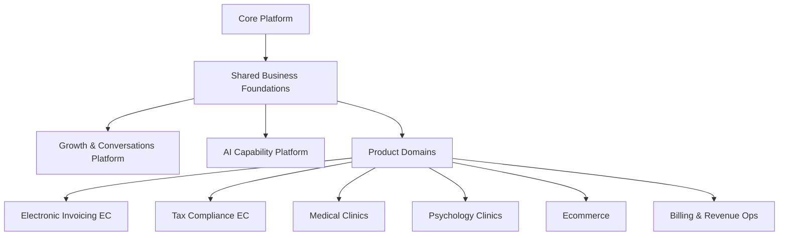
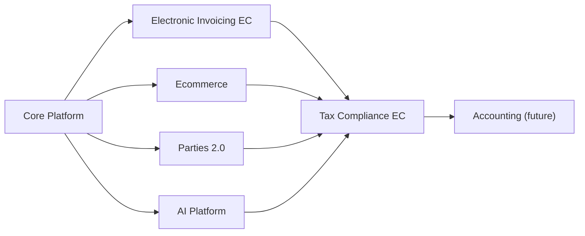

# SaaS Conceptual Model

## Purpose

This document defines the target conceptual model for the SaaS platform so the team can:

- keep one architectural map while multiple products grow
- distinguish reusable platform capabilities from product-specific domains
- plan implementation in stages based on what already exists in the repository
- avoid coupling country-specific tax flows, ecommerce, clinics, marketing, and AI into one monolith

This model is intentionally more concrete than a whiteboard vision. It is meant to guide actual repository evolution.

## Guiding principles

1. Build the platform in layers, not as a flat list of features.
2. Keep `Core Platform` independent from business products.
3. Move reusable business concepts into shared foundations instead of duplicating them inside each product.
4. Treat `Growth / WhatsApp / Funnels` and `AI` as transversal capability platforms, not as ad hoc features inside one product.
5. Let every product keep its own bounded context, rules, terminology, and workflows.
6. Sequence delivery in stages so current code is reused rather than discarded.

## Target platform map

## Target portfolio and current catalog reality

The target portfolio we want to build is:

- `Electronic Invoicing EC`
- `Tax Compliance EC`
- `Medical Clinics`
- `Psychology Clinics`
- `Ecommerce`
- `Billing & Revenue Ops`

The repository catalog seed does not fully match that target yet.

### Current seeded products in the repository

Based on:

- `packages/infra/prisma/prisma/migrations/20260423190000_platform_catalog/migration.sql`
- `packages/infra/prisma/prisma/migrations/20260605100000_tax_compliance_product_catalog/migration.sql`

the current seeded product keys are:

- `invoicing`
- `tax-compliance-ec`
- `psychology`
- `learning`
- `ecommerce`

### Practical interpretation

- `invoicing` should evolve into `Electronic Invoicing EC`
- `tax-compliance-ec` is now the formal product anchor for Ecuador tax obligations, evidence, review packets, closeout, and external filing/payment handoff
- `psychology` is already directionally aligned with `Psychology Clinics`
- `ecommerce` is already directionally aligned with the target portfolio
- `learning` is currently outside the product list we are prioritizing in this strategy
- `Medical Clinics` and `Billing & Revenue Ops` are target products, but are not yet formalized in the seeded catalog
- `Accounting` remains a future product candidate. Tax Compliance EC now exposes an accounting bridge mapping, but it intentionally stops before chart-of-accounts ownership, journals, ledgers, balances, or formal accounting close

### Recommendation

Do not force a large catalog refactor immediately.

Instead:

1. keep `invoicing` as the current product key while we evolve its semantics toward Ecuador electronic invoicing
2. keep `psychology` and `ecommerce` as valid current portfolio anchors
3. decide later whether `learning` remains part of the broader company portfolio or becomes out of scope for this roadmap
4. add `accounting`, `medical`, and `billing` to the catalog only when we are ready to start their first real slices
5. keep Parties 2.0 as the shared fiscal directory foundation for Tax Compliance EC, Ecommerce, Invoicing, and the future Accounting product

## Layer 1: Core Platform

This is the tenant-aware SaaS operating system. It should not know product-specific tax rules, patient flows, or ecommerce checkout details.

### Responsibilities

- users
- tenants
- memberships
- roles
- permissions
- invitations
- authentication
- current tenancy resolution
- plans
- subscriptions
- entitlements
- feature flags
- product catalog
- product access enforcement
- audit and operational hooks

### Current repository status

Already implemented in meaningful form:

- identity
- tenancy
- RBAC
- auth/session resolution
- plan and entitlement model
- feature flags
- enabled product resolution
- product/module catalog

Main current modules:

- `apps/api-platform/src/app/modules/auth/auth.module.ts`
- `apps/api-platform/src/app/modules/tenancy/tenancy.module.ts`
- `apps/api-platform/src/app/modules/commercial/commercial.module.ts`
- `apps/api-platform/src/app/modules/catalog/catalog.module.ts`
- `apps/api-platform/src/app/modules/feature-flags/feature-flags.module.ts`

## Layer 2: Shared Business Foundations

These are reusable business concepts that more than one product will need.

They are not `Core Platform`, because they are business-facing. They are not product-specific either, because they will be reused across invoicing, ecommerce, accounting, and possibly clinics.

### Recommended bounded contexts

- `Party`
  - people, companies, suppliers, customers, patients, leads
- `Address`
  - fiscal, shipping, billing, service location
- `Tax Identity`
  - country-specific taxpayer identifiers and classification
- `Catalog`
  - products, services, bundles, priceable items
- `Pricing`
  - currencies, prices, discounts, pricing rules
- `Payments`
  - payment records, payment methods, allocations, reversals
- `Numbering`
  - commercial or tax numbering sequences
- `Files & Attachments`
  - PDFs, XMLs, media, evidence, signed documents
- `Timeline / Activity`
  - user and domain activity events

### Current repository status

Partially present, but still embedded inside `Invoicing`:

- `Customer`
- `TaxRate`
- `Payment`
- first read-only `Party` directory already exists as a shared facade backed by `Customer`

Current locations:

- `packages/core/invoicing/domain/src/lib/entities/customer.entity.ts`
- `packages/core/invoicing/domain/src/lib/entities/tax-rate.entity.ts`
- `packages/core/invoicing/domain/src/lib/entities/payment.entity.ts`
- `packages/core/parties/domain`
- `packages/core/parties/application`
- `apps/api-platform/src/app/modules/parties`

### Recommendation

Do not extract these immediately if it slows delivery.

Instead:

- keep them working where they are
- mark them as future candidates for extraction into shared foundations
- avoid naming or behavior that makes them impossible to reuse later
- use small read models like `Party` to prove the extraction path before moving persistence or write workflows

## Layer 3: Growth & Conversations Platform

This is the transversal commercial engine shared by all products.

It should not live inside `Ecommerce`, `Clinics`, or `Invoicing`.

### Responsibilities

- funnels
- landing pages
- forms
- lead capture
- lightweight CRM
- sales pipelines
- campaigns
- automations
- conversation threads
- WhatsApp integration
- templates
- assignment to human or AI agents
- attribution and conversion tracking

### Why this is transversal

All target products need some variant of:

- lead capture
- follow-up
- conversion
- reminders
- sales communication

Examples:

- `Electronic Invoicing EC`: onboarding and renewal conversations
- `Tax Compliance EC`: lead nurture and declaration reminders
- `Medical Clinics`: appointment acquisition and confirmations
- `Psychology Clinics`: intake and follow-up flows
- `Ecommerce`: campaigns, abandoned cart, post-sale journeys

### Recommended future contexts

- `Growth`
- `Conversations`
- `Campaigns`
- `Automation`

## Layer 4: AI Capability Platform

This is also transversal and should not be implemented as isolated logic inside each product.

### Responsibilities

- model orchestration
- prompt registry and versioning
- retrieval and context loading
- AI-ready context contracts exposed by each domain before model logic is added
- tool calling
- permissions and data access boundaries
- audit trails of AI actions
- approval workflows for high-risk actions
- evaluation and observability
- memory scoped by tenant and domain
- suggestion mode versus execution mode, with explicit guardrails between them

### Required platform pattern

Every product should expose deterministic, domain-owned surfaces first, and the AI platform should consume those surfaces rather than bypass them.

Examples:

- `Growth` can expose a guided agenda contract with tasks, reply suggestions, next actions, warmth hints, and playbooks
- `Electronic Invoicing EC` can expose drafting, review, and checklist surfaces for tax documents
- `Ecommerce` can expose product, catalog, landing, and campaign context surfaces

That means:

- prompts should not become the hidden source of truth for domain logic
- the domain still owns business rules, approvals, and workflow state
- the AI platform sits above those contracts to suggest, explain, draft, or automate within explicit boundaries

### Agent families on top of it

- `Tax Accountant AI`
- `Electronic Invoicing Assistant AI`
- `Medical Assistant AI`
- `Psychology Assistant AI`
- `Ecommerce Content AI`
- `Funnels / Sales AI`
- `Billing Assistant AI`

### Important rule

There should be one `AI Platform`, many specialized agents, and strict domain-scoped access.

The AI platform is not the same thing as a product-specific guided UI.

For example:

- `Growth Assist` is a product/workspace surface
- future `Growth AI` capabilities should plug into that surface through the transversal AI platform
- the same pattern should hold for invoicing, ecommerce, and future vertical products

## Product domains

## Product: Electronic Invoicing EC

This should be treated as a country-aware tax document product for Ecuador, not only as generic invoice CRUD.

### Current repository status

This is the most advanced business domain in the codebase today.

Implemented foundation:

- customers
- invoices
- invoice items
- tax rates
- invoice totals
- invoice document preview and printable HTML
- email sending
- reporting summary
- lifecycle
- payments
- partial payment reconciliation
- payment reversal support

Main current module:

- `apps/api-platform/src/app/modules/invoicing/invoicing.module.ts`

### Current scope

What exists today is already closer to:

- `Electronic Invoicing Ecuador Foundation`

than to:

- `Commercial Invoicing Core`

### Ecuador-specific capabilities already implemented

- issuer fiscal profile
  - RUC
  - razón social
  - nombre comercial
  - dirección matriz
  - ambiente y tipo de emisión
  - obligado a llevar contabilidad
  - contribuyente especial
  - RIMPE metadata when applicable
- Ecuador buyer identification semantics
  - type of identification
  - identification number
  - buyer address snapshot
- Ecuador numbering and authorization metadata
  - `codDoc`
  - `estab`
  - `ptoEmi`
  - `secuencial`
  - `claveAcceso`
  - authorization status
  - authorization number
  - authorization timestamp
- tax document structure and previews
  - `infoTributaria`
  - `infoFactura`
  - `infoNotaCredito`
  - `infoNotaDebito`
  - `infoGuiaRemision`
  - `infoCompRetencion`
  - payment method nodes
  - additional information fields
- XML generation aligned to SRI semantics
- XSD validation in repo for:
  - factura (`01`)
  - nota de crédito (`04`)
  - nota de débito (`05`)
  - guía de remisión (`06`)
  - comprobante de retención (`07`)
- RIDE generation and formal artifact downloads
- submission history, readiness checks, presigned XML path
- support for:
  - factura (`01`)
  - nota de crédito (`04`)
  - nota de débito (`05`)
  - guía de remisión (`06`)
  - comprobante de retención (`07`)

### Ecuador-specific capabilities still missing or partial

- remote sandbox onboarding still needs smoother tenant bootstrap ergonomics
- the internal PKCS#12 signer is already much stronger, but still needs sustained CELCER validation with a sandbox-enabled taxpayer
- remote sandbox rollout still depends on real issuer-certificate alignment, not just local fixtures
- richer debit-note and withholding operations can still grow beyond the current electronic baseline

### Strategic recommendation

Treat the current implementation as a strong `Electronic Invoicing EC` foundation, but not yet as the finished country product.

## Product: Tax Compliance EC

This is different from invoicing and should not be collapsed into it.

It should start as an Ecuador tax compliance product for operational tax
obligations, not as a full accounting suite. The first useful product is the
control room that turns invoices, retentions, ecommerce activity, parties and
periods into "what must be reviewed, prepared, explained, and handed to a human
accountant when needed".

### Responsibilities

- VAT support
- income tax support
- tax periods
- tax obligation calendar
- taxpayer profile
- obligation readiness checks
- SRI fiscal evidence intake for received and issued vouchers
- tax books
- tax reconciliations
- declaration workflows
- declaration form draft packets
- attachments and evidence
- filing assistance
- accountant review packets

### AI opportunities

- declaration drafting assistant
- tax review assistant
- assisted SRI form walkthroughs
- anomaly detection
- taxpayer checklist assistant

### Current repository status

Implemented as the `tax-compliance-ec` product anchor with its own access
permissions, Ecuador tax period workspaces, obligation settings, due monitors,
VAT/income tax/withholding readiness, purchase evidence, evidence vault,
annexes readiness, accountant review packets, operational closeout, external
filing/payment handoff, accounting bridge mapping, Growth reminder packets, and
a transversal AI review assistant template. The SRI source import, assisted IVA
and income-tax declaration workspaces, filing assistant, professional escalation
boundary and declaration handoff closeout 6.0 are now part of the implemented
Tax Compliance path.

Current backlog: harden the operator UI, accountant packet, smoke coverage and
evidence import depth around that path. The product may suggest form box values,
show the evidence behind each value, explain the step-by-step SRI online filing
path, and generate XML/JSON/Excel artifacts only where the SRI publishes
compatible formats. It must not store SRI credentials, bypass recaptcha, submit
declarations, sign forms, or pay taxes automatically.

### Relationship to invoicing

Consumes data from:

- electronic invoices
- retentions
- payments
- customer and supplier tax identities

But remains its own product context.

### Boundary with accounting

`Tax Compliance EC` should not pretend to be full accounting at the beginning.

Full accounting is a later and heavier product context, responsible for:

- chart of accounts
- journal entries
- ledgers
- trial balance
- bank reconciliation
- financial statements
- deeper accountant workflows

The recommended sequence is:

1. build `Tax Compliance EC` first around tax obligations, periods, readiness,
   evidence and accountant handoff
2. use that product to learn which customers need formal accounting depth
3. only then graduate the heavier `Accounting` product when the platform has
   enough demand and shared foundations to justify it

The current bridge to that future product is an accounting readiness packet:
Tax Compliance EC can recommend whether a tenant should stay inside the tax
control room or graduate into `Accounting`, but it still does not own chart of
accounts, journals, ledgers, trial balance, bank reconciliation, or financial
statements.

## Product: Medical Clinics

### Responsibilities

- professionals
- specialties
- patients
- appointments
- schedules
- clinical encounters
- history records
- prescriptions
- reminders

### AI opportunities

- appointment assistant
- note drafting
- history summarization
- follow-up assistant

### Current repository status

Implemented as an operational vertical MVP. Current repository coverage now
includes:

1. product catalog anchor, modules, permissions and entitlement
2. operational profile workspace for clinic identity, care locations,
   professionals and service catalog
3. patient intake workspace with identification, contact, consent and
   representative readiness
4. appointment scheduling workspace with lifecycle status, reminders and
   billing readiness
5. Growth reminder bridge for reviewed WhatsApp handoff
6. Billing and Tax bridge for invoice draft readiness and Tax Compliance EC
   evidence handoff
7. durable persistence for profile, patients, appointments and operational
   events
8. clinical encounter packets for note drafts, follow-up readiness,
   prescription readiness and encounter closeout
9. patient records workspaces for timeline, medical history drafts, evidence
   registry, orders/referrals, care plan tasks and records closeout
10. product activation closeout and web command center surfaces

It still intentionally excludes formal signed EHR records, automatic diagnosis,
official prescriptions and replacement of professional medical judgment.

## Product: Psychology Clinics

### Responsibilities

- therapists
- patients
- sessions
- treatment tracking
- notes
- follow-up
- reminders

### AI opportunities

- appointment assistant
- structured note drafting
- session summary helper

### Current repository status

Foundation implemented in the repository.

The current slice introduces `Psychology Clinics` as a Stage 8 vertical service
product with a product anchor, profile workspace, patient intake workspace,
session scheduling workspace, review-only session note draft packet, foundation
closeout, durable Prisma persistence, Nest API endpoints, and typed web client
contracts.

Boundaries: Psychology Clinics does not replace therapist judgment, does not
auto-diagnose, does not automatically classify patient risk, and does not create
a signed legal/EHR record. Session notes are draft packets that require therapist
review and cannot be signed automatically.

Recommended next slices:

1. `tax-compliance-ec-operating-hardening`: return to Tax Compliance EC now
   that Psychology Clinics can pause as an MVP.
2. `accounting-advanced-discovery`: evaluate whether Accounting Foundation
   should graduate into ledger-grade advanced workflows.
3. `psychology-external-ehr-discovery`: reopen Psychology Clinics only if a
   customer explicitly needs an external EHR/document integration.

Operations 2.0 is now represented by the web command center plus treatment
plans, follow-up readiness, Growth reminder bridge, Billing/Tax bridge, patient
timeline and operations closeout packets. The product is still intentionally
review-first: reminders are drafts, billing is a handoff, and treatment plans do
not infer diagnosis or clinical risk.

Records 3.0 and EHR Readiness 4.0 are represented by records hardening,
clinical evidence registry, session note review loop, risk/safety review,
privacy consent controls, EHR discovery, formal signature readiness, outcomes
review, assessment scale registry, external document handoff contracts and
closeout v4 packets. The boundary remains explicit: the platform prepares
reviewable contracts and evidence, but does not create a signed legal EHR
record, does not store binary clinical files as the source of truth, does not
auto-diagnose, does not automatically interpret assessment scales and does not
sign records on behalf of a therapist.

Closeout 5.0 adds EHR integration evaluation, clinical admin hardening,
therapist review work queue, product readiness report, boundary/compliance
closeout and final product closeout. The result is that Psychology Clinics can
pause as an MVP while external EHR integration is intentionally deferred. The
recommended next product focus returns to `Tax Compliance EC`.

Operating Hardening 6.0 brings Psychology Clinics to the same operator-grade
level as Medical Clinics: command center, patient privacy/risk queue, session
and treatment queue, cross-product handoff center, and operating closeout. This
does not reopen the EHR boundary. It makes the MVP safer to pilot by separating
patient consent/risk work, therapist review work, Growth/AI/Billing/Tax/Parties
handoffs, and final closeout evidence into explicit reviewed surfaces.

The 6.0 layer adds:

1. `Psychology Clinics Roadmap Refresh 6.0`
   - marks foundation, operations, records, EHR readiness, product closeout,
     AI/Growth bridges and smoke as implemented capability
2. `Psychology Clinics Command Center 6.0`
   - consolidates product anchor, operations closeout, product readiness,
     closeout v5, patient privacy and sessions into one operator surface
3. `Patient Privacy, Consent & Risk Review Queue`
   - prioritizes identity, contact, therapy consent, messaging opt-in and
     initial risk review before session operation
4. `Session & Treatment Operations Queue`
   - tracks reminders, billing readiness, treatment review and therapist review
     across active sessions
5. `Psychology Cross-Product Handoff Center`
   - packages Growth reminders, AI boundary, Billing/Invoicing, Tax Compliance
     EC and Parties handoffs without moving ownership into Psychology
6. `Psychology Clinics Operating Closeout 6.0 + Smoke`
   - validates command center, privacy/risk queue, session/treatment queue,
     cross-product handoffs, closeout v5 and guardrails as one narrative

Records 3.0 adds records hardening, clinical evidence registry, session note
review loop, risk/safety review workspace, privacy/consent control center and
records closeout. It still does not create a signed legal EHR record, store
binary clinical files, diagnose, classify risk automatically, or replace
therapist judgment.

## Product: Ecommerce

### Responsibilities

- catalog
- inventory
- storefront content
- cart
- checkout
- orders
- shipping
- payment capture
- refunds
- post-purchase communication

### AI opportunities

- landing page generation
- product copy generation
- merchandising assistant
- template generation

### Current repository status

The product has moved past catalog seed status and now exists as an implemented
domain slice.

Implemented surfaces include:

- product authoring, product setup, product entities, channel drafts, channel
  assets and release candidates
- storefront preview, go-live readiness and live storefront session workspaces
- checkout customer capture, order draft persistence and order operator boards
- invoice handoff, payment confirmation, dispute handling, fulfillment
  readiness, delivery confirmation and post-sale reporting
- web clients, Nest API surfaces, Prisma repositories and ecommerce closeout
  smokes

Current persistence foundation:

- product drafts
- product setups
- product entities
- product entity channel drafts
- order drafts

Current boundary:

Ecommerce is still an operator-assisted commerce domain, not a full
transactional commerce engine. Payments, shipping, refunds, inventory stock and
carrier/provider integrations are represented as readiness/workspace/packet
surfaces before live external execution is introduced.

### Closeout backlog

Ecommerce is now mature enough to close as an MVP orchestration product before
opening the next major domain.

The remaining closeout work should stay small and documentary:

- publish a clear Ecommerce closeout report
- document the implemented operator-assisted commerce model
- capture the end-to-end flow from launch to post-sale live execution
- preserve the known boundary between readiness/workspace/packet surfaces and
  future live external execution
- keep a short backlog of future transactional integrations:
  - live storefront publish
  - provider-backed checkout and payment capture
  - carrier-backed shipping/tracking
  - live inventory reservations
  - refunds, returns and cancellations

This closeout should not become another expansion slice unless it reveals a
blocking gap in the current implemented flow.

## Strategic Product Backlog

The current platform history suggests this product order:

1. `Parties 2.0`
   - status: foundation closeout in progress
   - purpose: turn the first party directory into a stronger fiscal/customer/
     supplier foundation
   - output: fiscal third-party profiles, customer/supplier role bridge,
     duplicate/merge readiness, supplier/customer declaration readiness,
     closeout pack and smoke narrative
   - reason: `Tax Compliance EC` depends heavily on reliable third-party fiscal
     data
2. `Tax Compliance EC hardening`
   - status: active product already built, next hardening candidate after
     Parties 2.0 closeout
   - purpose: keep improving Ecuador tax obligations like VAT, income tax,
     retentions, period readiness, evidence quality and accountant review
   - output: stronger SRI evidence intake, declaration artifacts, quality
     center and accountant collaboration loops
   - reason: now consumes `Invoicing`, `Ecommerce`, `Parties`, `Growth`, `AI`
     and Accounting Foundation
3. `Accounting Advanced`
   - status: future candidate, not automatic
   - purpose: graduate from foundation accounting only when tenants need formal
     books, certified bank feeds, ledger-grade controls or accountant-owned
     closeout
   - output: official books, bank statement certification, advanced closeout
     and professional accounting workspaces
   - reason: should be opened only when Tax Compliance and Parties surface gaps
     that cannot be handled by assisted tax workflows

### Product decision

`Parties 2.0` is the current enabling foundation closeout. Once its fiscal
directory, role bridge, duplicate readiness and closeout pack are stable, the
recommended next step is to return to `Tax Compliance EC` hardening rather than
opening `Accounting Advanced` by default.

The product should support businesses that can self-serve tax readiness, while
also recognizing that larger or more complex taxpayers will need a human
accountant. The right product shape is not "replace the accountant"; it is:

- prepare clean evidence
- explain the obligation status
- surface missing data
- package declaration inputs
- let the accountant review, correct and approve

That gives small businesses value early and gives larger businesses a safer
bridge into a future accounting product.

## Product: Billing & Revenue Ops

This is the product that should carry commercial revenue operations for the SaaS itself.

It should not be confused with Ecuador electronic invoicing.

### Responsibilities

- recurring billing
- receivables
- subscription billing operations
- revenue follow-up
- dunning
- commercial invoicing for the SaaS vendor

### Why it matters

The business list originally included both:

- `facturación electrónica`
- `facturación`

Those should not stay ambiguous.

The clean split is:

- `Electronic Invoicing EC`
- `Billing & Revenue Ops`

## Current implementation snapshot

## Already present and usable

- core platform identity, tenancy, RBAC, commercial access, product catalog
- current product gating in API and web
- advanced `Invoicing` slice with lifecycle, payments, reversals, reports, notifications
- React shell with multi-slice workspace behavior

## What the repository already teaches us

The current codebase is already strong enough to guide the next stages.

### Proven in code

- multi-tenant access control works
- product catalog and product gating work
- frontend and backend can cooperate around enabled products
- one business domain can grow in slices without breaking the platform
- release/versioning flow is already established for `api-platform`

### Proven by version history

Current backend version:

- `apps/api-platform/package.json` -> `0.16.0`

Recent product evolution in `main`:

- `37807f0` first invoicing foundation
- `92b8100` taxes, documents, notifications, reports, lifecycle, payments
- `41da065` payment reconciliation and reversals
- `114e686` release cut to `0.16.0`

### Important consequence

We should not restart the model from scratch.

We should use the current repository as:

- the real `Stage 0` and `Stage 1` baseline
- the foundation for `Electronic Invoicing EC`
- the eventual teaching ground for shared foundations extraction

## Present in catalog but not implemented as domain

- `ecommerce`
- `psychology`
- `learning`

## Not implemented yet

- shared business foundations as their own bounded contexts
- growth platform
- conversations / WhatsApp platform
- AI capability platform
- accounting and tax compliance
- clinics

## Recommended staged roadmap

## Stage 0: Platform baseline

### Goal

Build the SaaS operating system and access model.

### Status

Substantially done.

### Included

- auth
- tenancy
- RBAC
- subscriptions
- entitlements
- feature flags
- product catalog

## Stage 1: Invoicing commercial core

### Goal

Prove one real business domain end to end.

### Status

Done and already advanced in the repository.

### Included

- customers
- invoices
- items
- taxes
- reports
- payments
- reversals
- document preview
- notifications

## Stage 2: Electronic Invoicing Ecuador MVP

### Goal

Convert current invoicing into a real Ecuador-compliant electronic invoicing product.

### Recommended slices

1. issuer tax profile
2. Ecuador numbering model
3. Ecuador buyer identification model
4. SRI XML generation
5. signature integration
6. SRI authorization workflow
7. RIDE generation
8. authorization status tracking

### Current progress snapshot

- slices `1` to `8` are already represented for invoice `01`
- credit note `04` already has numbering, draft flow, XML preview, RIDE, XSD validation, and submit path
- debit note `05` already has numbering, draft flow, XML preview, RIDE, XSD validation, and submit path
- remission guide `06` already has numbering, draft flow, XML preview, RIDE, XSD validation, and submit path
- withholding certificate `07` already has numbering, draft flow, XML preview, RIDE, XSD validation, and submit path
- the next Ecuador gap is no longer document coverage but compliance hardening around signer capability and remote sandbox behavior
- readiness now distinguishes `local stub`, `remote presigned`, and `remote internal signer`
- internal PKCS#12 material now has an OpenSSL-backed probe so the product can tell when signer secrets merely exist versus when the keystore can actually be opened and inspected
- signer inspection now also extracts certificate metadata and vigencia so the remote internal path can warn on upcoming expiry or block expired certificates
- signer inspection now also runs a cryptographic proof with the private key so the product can distinguish “keystore opens” from “private key is actually operable”
- readiness now also includes a local offline-compatibility probe so the product can tell when the internal signer already produces signed XML that passes structural offline checks plus local XSD validation for Ecuador document flows

### Why this is next

It leverages current work directly and turns `Invoicing` into a stronger, country-aware product.

### Concrete repository implication

This stage should happen mainly by evolving:

- `apps/api-platform/src/app/modules/invoicing`
- `packages/core/invoicing/domain`
- `packages/core/invoicing/application`
- `packages/infra/prisma/src/lib/invoicing`
- `apps/web-platform/src/app`

## Stage 3: Shared foundations extraction

### Goal

Extract reusable business concepts once at least two products need them.

### Candidates

- `Customer` to `Party`
- `TaxRate` to `TaxRule`
- `Payment` to shared payments context
- basic addresses and tax identities

### Important note

Do not extract too early if it slows product delivery.

### Current practical state

The repository already has the first safe pressure test of this stage:

- a read-only `Party` directory backed by `Invoicing.Customer`
- no persistence split yet
- no write workflow migration yet

This is intentional. It gives the platform a reusable business surface without forcing a premature data migration.

## Stage 4: Growth & Conversations Platform

### Goal

Create the transversal commercial engine used by all products.

### Recommended slices

1. lead capture
2. conversation thread foundation
3. pipeline
4. WhatsApp conversation inbox
5. message templates
6. funnel pages
7. automations

### Important timing note

This platform is transversal, but we do not need to build all of it before the next product.

The healthiest sequence is:

- first mature `Electronic Invoicing EC`
- then introduce the first reusable `Growth` slices
- then let `Ecommerce` and `Clinics` consume them

## Stage 5: AI Capability Platform

### Goal

Build one transversal AI runtime for domain-specific assistants.

### First slice now grounded in the repo

- the first transversal slice should not begin with direct model execution
- it should begin by making the platform explicit and auditable:
  - a transversal `AI` module
  - an agent catalog
  - a prompt registry with visible versioning
  - tenant/domain-scoped suggestion envelopes
  - a first consumer that still stays in `suggestion` mode
- that first slice now has a natural starting point in the repository:
  - `GET /api/ai/agents`
  - `GET /api/ai/prompts`
  - `GET /api/ai/agents/:agentKey/prompt-pack`
  - `GET /api/ai/tenants/:slug/agents/growth-assist-coach/suggestion-envelope`
- the first real consumer should be `Growth Assist`, but only as a surface:
  - the AI layer consumes `growth.assist.daily_agenda`
  - it does not become the new source of truth for Growth
  - it does not send messages or mutate workflow state automatically
  - it prepares a constrained, auditable handoff for future model-backed suggestions
- the next grounded step after envelopes and prompt packs is an auditable run history:
  - `POST /api/ai/tenants/:slug/agents/:agentKey/suggestion-runs`
  - `GET /api/ai/tenants/:slug/agents/:agentKey/suggestion-runs`
  - this gives the transversal AI platform memory of who prepared a suggestion handoff, when, for which tenant, and with which prompt-pack version
  - that history should exist before any guarded execution path is introduced

### Recommended slices

1. AI runtime and prompt registry
2. tenant-scoped retrieval
3. AI-ready domain contract review
4. tool access model
   - expose a transversal tool registry
   - expose per-agent tool access rules
   - make envelopes explicit about which tools are allowed, which need approval, and which are blocked
   - keep execution tools blocked until approval and guarded-execution flows exist
5. audit and approval flows
   - the first approval slice can stay in `suggestion mode`
   - it should approve or reject auditable suggestion handoffs before any guarded execution path exists
   - approval memory should be tenant-scoped, agent-scoped, and attached to concrete run history
   - that keeps the human review loop explicit before the platform starts unlocking higher-risk execution tools
6. first agent for invoicing/tax tasks
   - expose an AI-ready deterministic surface from invoicing first:
     - `GET /api/invoicing/tenants/:slug/assist/document-drafting`
   - then let `invoice-document-assistant` become the second `ready` agent in suggestion mode
   - the agent should explain checklist gaps, drafting order, and blocked actions
   - it must not sign, submit, authorize, or claim fiscal validity automatically
7. first suggestion-mode agent for Growth Assist surfaces

### Suggested delivery discipline

- first expose deterministic domain contracts that AI can consume
- then add AI suggestion mode on top of those contracts
- then add human approval loops on top of auditable suggestion runs
- only after observability and approval flows exist should the platform move from suggestions into guarded execution

## Stage 6: Ecommerce

### Goal

Launch the next major product on top of the existing platform and shared foundations.

### Recommended slices

1. keep the conceptual map aligned with the implemented ecommerce domain
2. complete editable order buyer/fiscal profile operations
3. add fulfillment and inventory availability foundations
4. introduce real stock/capacity reservations on product entities
5. introduce provider-backed payment capture and reconciliation
6. introduce refunds, returns and cancellation operations
7. add shipping/tracking provider handoffs
8. add AI content and merchandising helpers on top of stable commerce contracts

### Why this is the next major product after Ecuador invoicing

`Ecommerce` will pressure exactly the right shared foundations:

- catalog
- pricing
- customers / parties
- addresses
- payments
- growth flows

That makes it the best second major product for validating the multi-product architecture.

## Stage 7: Tax Compliance EC

### Goal

Turn invoices, retentions, ecommerce activity, parties and payments into Ecuador
tax obligation readiness and declaration preparation workflows.

### Recommended slices

1. taxpayer profile and obligation matrix
2. tax period workspace
3. VAT, income tax and withholding readiness summaries
4. supporting evidence and accountant handoff packets
5. AI tax review assistant over deterministic compliance contracts
6. accounting bridge mapping and suggested accounts
7. Growth reminder packets for due obligations
8. accounting readiness packet for the future Accounting product decision

### Backlog: SRI evidence and assisted declaration preparation

These slices should be solved inside `Tax Compliance EC` before graduating full
`Accounting`, because they are about fiscal evidence and tax declaration
readiness rather than ledgers or financial statements.

1. `SRI Fiscal Evidence Intake`
   - import taxpayer-provided SRI reports/XML for issued and received
     electronic vouchers
   - normalize invoices, credit notes, debit notes, withholdings, purchase
     settlements, RIDE/XML references, access keys, authorization dates, parties,
     bases, VAT, and withholding amounts
   - deduplicate against Invoicing, Ecommerce, purchases, and existing evidence
   - keep credential handling out of scope; the user or accountant downloads
     from SRI and uploads/imports into the platform
2. `SRI vs Platform Reconciliation`
   - compare SRI evidence against platform-native sales, ecommerce orders,
     purchases, retentions, and party identities
   - surface missing vouchers, duplicated access keys, mismatched VAT bases,
     missing credit/debit notes, and unsupported manual evidence
   - feed VAT, income tax, withholding, annex, closeout, and accountant review
     readiness
3. `Tax Declaration Form Catalog`
   - model supported SRI declaration forms as deterministic contracts
   - start with IVA, Income Tax for natural persons/societies where practical,
     and withholding declarations
   - track taxpayer profile compatibility, periodicity, required evidence,
     form boxes, calculation rules, manual-only boxes, and review requirements
4. `Declaration Draft Packet`
   - implemented as a deterministic packet with suggested form values per
     period and form
   - attaches evidence and calculation explanation to every suggested box
   - classifies each box as ready, needs review, blocked, or manual-only
   - produce accountant-facing differences between SRI evidence, platform data,
     and the suggested declaration draft
5. `AI Filing Guide Assistant`
   - implemented as a guided manual-entry packet that explains the SRI online
     filing path step by step
   - generates copy/paste guidance and review checklists over deterministic
     draft packets and source evidence
   - never submits, signs, pays, bypasses recaptcha, or replaces accountant

6. `Declaration Artifact Export`
   - implemented as JSON/checklist export support for operational evidence
   - marks official XML/Excel as manual-only unless SRI publishes supported
     technical guides, templates, or schemas that are explicitly modelled
   - keep upload/submission as an external human action recorded through filing
     handoff

### Declaration preparation closeout layer

Tax Compliance EC now treats declaration preparation as a layered flow rather
than a single form helper:

1. `Declaration Source Ledger`
   - normalizes issued and received evidence from Invoicing, SRI imports,
     purchase evidence, ecommerce placeholders, and accounting closeout signals
   - exposes source totals, VAT input/output, withholding credits, gap counts,
     blockers, and guardrails per tax period
2. `VAT Declaration Draft Workspace`
   - turns the source ledger into IVA buckets such as taxable sales, zero-rate
     sales, creditable purchases, non-creditable purchases, and withholdings
   - links those buckets to deterministic declaration draft boxes and estimated
     VAT payable
3. `Tax Form Mapping Catalog`
   - maps supported SRI form boxes to source metrics with confidence levels
   - makes manual-only boxes visible before the operator or accountant begins
     filing work
4. `Income Tax Evidence Workspace`
   - groups fiscal sources into revenue, deductible expenses, review-only
     expenses, and withholding credits
   - prepares income tax evidence without pretending to be a full ledger or
     formal accounting close
5. `Tax AI Filing Assistant Packet`
   - explains the filing sequence over deterministic source ledgers, IVA
     workspaces, and income tax evidence
   - asks accountant-facing questions and preserves strict guardrails: no
     automatic submission, signature, payment, credential handling, captcha
     bypass, or accountant replacement
6. `Declaration Review Loop Workspace`
   - connects accountant reviews, filing handoff state, source ledger health,
     and a checklist into one operational loop
   - supports the path from draft-ready to accountant review, approved filing,
     and externally filed/paid closeout

### Tax compliance closeout expansion

The next Tax Compliance EC layer strengthens declaration readiness into a
period-certification flow:

1. `Taxpayer Obligation Matrix 2.0`
   - projects taxpayer profile, current period applicability, accountant gates,
     form coverage, evidence sources, and closeout gates into one workspace
2. `SRI Evidence Intake 2.0`
   - reviews SRI report/XML/manual channels, deduplication, ledger coverage,
     blocked vouchers, and review vouchers before the evidence enters forms
3. `IVA Form Contract 2.0`
   - turns VAT draft buckets and form mappings into deterministic contract boxes
     with confidence, evidence source, amount, and manual-only visibility
4. `Income Tax Form Contract 1.0`
   - groups revenue, deductible expenses, taxable base, and withholding credits
     into accountant-reviewable lines without replacing formal accounting
5. `Annexes Readiness Workspace`
   - elevates annex readiness into actionable work items connected to the
     declaration source ledger and evidence sources
6. `Tax Period Closeout Certification`
   - combines closeout report, declaration review loop, obligation matrix,
     checklist state, accountant questions, and external filing signal into the
     final operational certification gate

### Tax Compliance EC product closeout layer

The final closeout layer makes Tax Compliance EC usable as an operator-facing
product rather than only a set of packets:

1. `Tax Compliance Command Center`
   - summarizes certification, SRI intake, VAT contract, income tax contract,
     annexes, blockers, accountant questions, and filing state into one period
     command surface
2. `Accountant Collaboration Pack 2.0`
   - packages certification blockers, VAT/renta review questions, evidence refs,
     priority, and ownership for professional review
3. `Tax Filing Evidence Vault 2.0`
   - extends the fiscal evidence vault with certification evidence, missing
     items, required-for labels, and defensible closeout folders
4. `Tax Compliance Exception Center`
   - turns SRI, annex and certification blockers into a prioritized resolution
     queue with owner and recommended action
5. `Annual Tax Rollup Workspace`
   - rolls current certified period evidence into annual income-tax context:
     revenue, deductible expenses, taxable base, credits and blocked periods
6. `Tax Compliance Product Closeout Pack`
   - declares whether the MVP is complete, records smoke/docs/guardrails, and
     recommends the next product direction such as Parties 2.0 or hardening

### Tax Compliance EC accounting closeout bridge

The next Tax Compliance EC layer consumes the completed Accounting foundation as
comparative evidence, not as a full statutory accounting subsystem:

1. `Accounting Evidence From Foundation`
   - gathers tax accounting readiness, period closeout report and command center
     evidence into one source summary for declaration review
2. `Tax Compliance Command Center 2.0`
   - extends the command center with Accounting foundation status, accounting
     evidence blockers and mapped/unmapped accounting hints
3. `Assisted Declaration Review Pack 2.0`
   - combines form draft boxes, Accounting comparative evidence and command
     center tiles into accountant-owned review questions before filing handoff
4. `Tax / Accounting Boundary Closeout`
   - records which gaps remain inside Tax Compliance EC and which ones belong to
     future `Accounting Advanced`, such as official books, certified bank feeds,
     multi-period statements or auditor workflows

Guardrail: this layer prepares, compares and explains. It still does not file
returns automatically, pay taxes, certify financial statements, or replace the
contador decision.

### Tax Compliance EC declaration closeout 2.0

The next layer turns the accounting bridge into an end-to-end declaration
preparation control room:

1. `SRI Source Import Center 2.0`
   - centralizes taxpayer-provided SRI report/XML/manual imports, source
     channels, deduplication and reconciliation issues against platform data
2. `VAT Declaration Workspace 2.0`
   - packages IVA buckets, suggested form boxes and Accounting Foundation
     comparative evidence for human review
3. `Income Tax Evidence Workspace 2.0`
   - combines period income-tax evidence, annual rollup and Accounting
     comparative evidence into accountant-owned renta review lines
4. `Tax Filing Assistant 2.0`
   - converts evidence into a guided, step-by-step manual SRI filing walkthrough
     with human gates and accountant questions
5. `Accountant Escalation & Service Boundary`
   - decides whether the tenant can continue with Tax Compliance assisted flow,
     needs accountant review, or should open `Accounting Advanced` discovery
6. `Tax Compliance Closeout 2.0`
   - summarizes SRI import, IVA, renta, assistant, escalation and command center
     readiness into one product closeout surface

Guardrail: this closeout is a preparation and review layer. It does not log into
SRI, submit returns, pay obligations, sign official books, or certify financial
statements.

### Tax Compliance EC operating readiness 3.0

The next layer makes Tax Compliance EC operable across evidence quality, risk,
accountant handoff and internal readiness certification:

1. `Tax Compliance Evidence Quality Center`
   - scores period evidence quality and highlights missing, duplicated,
     contradictory or stale evidence across SRI, platform, Accounting and manual
     sources
2. `Tax Obligation Risk Monitor`
   - converts IVA, renta, SRI import and accountant-boundary readiness into
     operational risk signals with accountant escalation flags
3. `Tax Accountant Handoff Room 2.0`
   - groups SRI, IVA, renta and filing questions into accountant/operator-owned
     sections with evidence references
4. `Tax Filing Readiness Certificate`
   - produces an internal readiness certificate before filing or accountant
     review; it is not proof of SRI submission or payment
5. `Tax Compliance Operating Dashboard 3.0`
   - summarizes command center, quality, obligation risk and readiness
     certificate tiles in one operational view
6. `Tax Compliance Product Closeout 3.0`
   - closes the MVP as operable, needs hardening, or blocked, and recommends Tax
     hardening, Parties 2.0, or Accounting Advanced discovery

Guardrail: operating readiness is an internal control layer. It helps decide,
prioritize and hand off, but still does not submit declarations, pay taxes, or
certify official financial/accounting outputs.

### Parties 2.0 closeout layer

Parties 2.0 now becomes the shared fiscal directory foundation between
Invoicing, Ecommerce, Tax Compliance EC and Accounting Foundation. It does not
yet introduce independent party persistence; instead it hardens the existing
party facade and makes the extraction path explicit.

1. `Party Directory 2.0 Core`
   - exposes a tenant-scoped fiscal directory with role, source context,
     linked products, fiscal status and next-step guidance
2. `Fiscal Identity and Ecuador Tax Profile`
   - packages RUC/cedula, identification type, fiscal address, email,
     missing-field counters and review notes for Ecuador tax readiness
3. `Party Roles Across Products`
   - bridges customer, supplier and lead roles back to Invoicing, Ecommerce,
     Growth, Tax Compliance EC and Accounting Foundation
4. `Duplicate and Merge Readiness Workspace`
   - detects duplicate candidates by taxpayer ID, email and normalized display
     name, suggests a survivor, and keeps merge execution out of scope
5. `Supplier and Customer Fiscal Readiness`
   - separates customer/supplier readiness for invoicing and declaration
     evidence without assuming that every party participates in every period
6. `Parties 2.0 Product Closeout Pack`
   - combines the five workspaces into an acceptance checklist and recommends
     either Tax Compliance hardening or Accounting Advanced discovery

The next product decision should read this closeout as a gate. If identity,
duplicates and supplier/customer readiness are clean, continue hardening Tax
Compliance EC. If the closeout repeatedly shows needs around formal books,
certified bank feeds or accountant-owned closeout, open Accounting Advanced
discovery.

### Tax Compliance EC party hardening 4.0

After Parties 2.0 closeout, Tax Compliance EC consumes the shared fiscal
directory as a hardening layer for declarations. The goal is to connect third
party data quality to VAT, income tax, withholdings, annexes, assisted
corrections and accountant review without claiming automated filing.

1. `Tax Compliance Party Evidence Bridge`
   - maps Parties 2.0 identity, duplicate and customer/supplier readiness into
     tax risks for IVA, renta, retenciones and anexos
2. `SRI Taxpayer Validation Readiness`
   - prepares candidate checks for RUC/cedula, identification type, taxpayer
     name and future official SRI validation or imported evidence comparison
3. `Declaration Party Impact Workspace`
   - groups risky parties by declaration type so operators can see exactly why
     a taxpayer, supplier or duplicate blocks a form
4. `Assisted Fiscal Correction Flow`
   - converts party risks into correction candidates with suggested payloads,
     affected declarations and an audit-oriented next step
5. `Accountant Review From Party Risks`
   - turns critical identity, supplier deductibility and declaration blocker
     signals into accountant questions and evidence references
6. `Tax Compliance Hardening Closeout 4.0`
   - combines party evidence bridge, validation readiness, declaration impact,
     correction flow, accountant review and product closeout v3 into a gate for
     continuing Tax hardening, opening Parties persistence, or considering
     Accounting Advanced discovery

Guardrail: this layer explains and prepares. It does not query SRI directly,
submit declarations, pay obligations, or mutate party records automatically.

### Tax Compliance EC party validation operations

The next layer makes the Tax + Parties hardening loop operational. It still
avoids full Parties persistence, but it introduces a ledger-style evidence
surface from tax events so operators can prove why a third party is trusted,
needs correction, or must go to an accountant.

1. `SRI Taxpayer Evidence Import`
   - records taxpayer evidence from SRI reports, XMLs, manual summaries or a
     future API connector as tax events linked to parties
2. `Party Fiscal Validation Ledger`
   - reconstructs a party-by-party validation history with evidence status,
     discrepancies, overrides and audit trail
3. `Tax Declaration Recalculation From Party Corrections`
   - compares declaration impact before/after fiscal evidence and correction
     candidates so IVA, renta, retenciones and anexos can be recalculated
4. `Accountant Review Execution From Party Risks`
   - converts party risk questions into the existing accountant review
     lifecycle while preserving party-specific evidence in the event log
5. `Parties Persistence Decision Pack`
   - decides whether the current facade is still acceptable or whether
     duplicate, supplier, validation and accountant pressure justify discovery
     for independent Parties persistence
6. `Tax + Parties Operational Command Center`
   - aggregates validation ledger, recalculation, accountant execution,
     persistence decision and hardening closeout into one operator gate

Guardrail: the validation ledger is event-sourced operational evidence, not the
final Parties persistence model. A dedicated Parties store should only be opened
after this command center repeatedly shows pressure that cannot be handled by the
facade.

### Tax Compliance EC declaration filing operations 3.0

The next layer turns the already-built evidence, form contracts, parties
validation, annexes and accountant handoff surfaces into a declaration-ready
operating lane. It still stops before SRI login, filing, payment or professional
certification.

1. `Tax Obligation Filing Workspace`
   - groups IVA, income tax, withholding and annex obligations per period with
     source-ledger coverage, form support, party risks and accountant gates
2. `SRI Form Box Evidence Binder`
   - explains every suggested form box with deterministic value, source rows,
     voucher references, SRI/platform differences, party risk and confidence
3. `Tax Annex Readiness 2.0`
   - elevates annexes into their own readiness layer with required sources,
     parties blockers, accountant questions and manual external filing guardrails
4. `Accountant Filing Review Room 3.0`
   - gives the accountant one room across obligations, form boxes, annexes,
     existing handoff state, questions, blockers and evidence references
5. `Declaration Artifact Export 2.0`
   - produces operational JSON/checklists/binders and keeps official XML/XLSX
     manual-only unless explicit SRI technical contracts are modelled
6. `Tax Compliance Declaration Closeout 3.0`
   - decides whether the period/form is ready for external filing handoff, needs
     accountant review, is blocked by evidence, or should open Accounting
     Advanced discovery

Guardrail: this layer prepares declarations for human action. It does not store
SRI credentials, bypass recaptcha, submit declarations, pay obligations, generate
unverified official files, or certify accountant review.

### Tax Compliance EC post-filing operations 4.0

After assisted declaration preparation, Tax Compliance EC needs an operational
control layer for what humans or accountants did outside the platform. This
layer records filing outcomes, payments, receipts and exceptions without logging
into SRI or paying obligations automatically.

1. `External Filing Result Recorder`
   - records submitted, rejected, under-review, payment-pending or paid external
     outcomes per obligation/form with reference, dates, responsible party,
     evidence refs and note
2. `Tax Payment Obligation Tracker`
   - separates filing from payment and tracks expected, paid and outstanding
     amounts, status, due signal and next action per obligation
3. `SRI Filing Receipt Evidence Vault`
   - organizes externally provided filing/payment receipts, references, PDFs,
     screenshots and accountant support into required/missing folders
4. `Post-Filing Exception Center`
   - prioritizes rejected filings, missing receipts, pending/partial payments
     and unresolved accountant-owned exceptions after external filing
5. `Tax Period Post-Filing Certificate`
   - issues an internal certificate that post-filing evidence, payment tracking,
     receipts and exceptions are complete enough for operational closeout
6. `Tax Compliance Post-Filing Closeout 4.0`
   - closes the period operationally, keeps it pending for payment/evidence,
     routes it to accountant review, or recommends Accounting Advanced discovery

Guardrail: post-filing operations record and organize human-provided external
evidence. They do not submit returns, pay taxes, download SRI receipts, certify
official compliance, or replace a contador.

### Tax Compliance EC annual and audit readiness 5.0

After period filing and post-filing operations, Tax Compliance EC can roll
evidence into an annual review layer for income tax, audit readiness and
accountant decisioning:

1. `Tax Annual Fiscal Year Workspace`
   - consolidates monthly period evidence, filing events, payment evidence and
     exceptions into a year-level operating view
2. `Annual Income Tax Reconciliation 2.0`
   - compares annual income, expense, withholding, accounting bridge and
     post-filing evidence before annual income-tax review
3. `Tax Audit Readiness Binder`
   - groups SRI evidence, declarations, receipts, party risks and accountant
     questions into review folders
4. `External Accountant Annual Review Room`
   - gives the external accountant a year-level room for blockers, questions,
     evidence references and manual review
5. `Accounting Advanced Discovery Gate`
   - decides whether official books, certified bank feeds, signed financials or
     auditor workflows justify opening Accounting Advanced
6. `Tax Compliance Annual Closeout 5.0`
   - closes the annual tax review as ready for external accountant review,
     blocked, or a trigger for Accounting Advanced discovery

Guardrail: annual readiness is still assisted evidence preparation. It does not
submit annual income tax, certify compliance, sign accounting outputs, or
replace a contador.

### Transversal AI/Growth clinic connectivity

Growth is connected to both clinic products through reviewed reminder/handoff
bridges: Medical Clinics has appointment confirmation/follow-up handoff
contracts and Psychology Clinics has reminder/follow-up bridge packets.

AI is now transversal for both clinic products through explicit
`medical-clinic-assistant` and `psychology-clinic-assistant` templates in the
AI platform. These agents consume deterministic clinic contracts, expose
suggestion envelopes, and stay behind approval-required review. They do not
diagnose, prescribe, sign records, interpret clinical risk, send emergency
messages, mutate clinic state, or replace professional judgment.

The next hardening should be UI-specific: richer clinic assistant briefing
panels and, later, a separate guarded-execution discovery only for non-clinical
administrative tasks.

The follow-up closeout adds typed web/API support and a smoke narrative for the
clinic AI assistants:

1. `Clinics Assistant UI Briefing Panels`
   - the AI console recognizes both clinic agents and can use the shared
     prepare/approval/detail flow
2. `AI Clinics Contract Registry Surface`
   - registry, guardrail approval pack and closeout Growth bridge endpoints are
     typed for web consumption
3. `Clinics AI Smoke Narrative`
   - validates medical and psychology envelopes, guardrails, Growth bridge
     connectivity and absence of guarded execution

This keeps clinic AI closed as a transversal suggestion layer, not a clinical
automation product.

### Tax/Accounting professional boundary 6.0

After annual and audit readiness 5.0, Tax Compliance EC now needs a clearer
professional boundary for businesses that are too large for pure self-service
but not automatically ready for full Accounting Advanced.

The 6.0 layer adds:

1. `Tax Compliance Professional Handoff 6.0`
   - composes period accountant handoff and annual closeout into one service-mode
     decision: assisted self-service, external accountant review, or Accounting
     Advanced discovery
2. `Accounting Advanced Gate 2.0`
   - enriches the existing gate with professional handoff pressure, annual
     closeout pressure and minimum evidence before opening advanced accounting
3. `Tax/Accounting Boundary AI Review`
   - exposes deterministic lanes for Tax Compliance, Accounting Foundation,
     Accounting Advanced and external accountant ownership
4. `Tax Accounting Boundary Assistant`
   - AI template that explains the boundary and prepares accountant questions
     without filing, paying, posting journals, certifying books, signing
     financial statements or replacing accountant judgment
5. `Declaration Handoff Closeout 6.0`
   - composes SRI source import, platform reconciliation, IVA draft workspace,
     income-tax evidence, assisted filing walkthrough, professional handoff,
     Accounting Advanced gate and AI boundary review into one period decision
   - decides whether the tenant should continue assisted Tax Compliance, send
     the packet to an external accountant, or open Accounting Advanced discovery

Guardrail: this layer helps explain and route professional work. It does not
turn Tax Compliance into full accounting and does not make AI a contador.

The 6.1 operating layer makes the 6.0 boundary visible and testable:

1. `Tax Compliance Roadmap Refresh 6.1`
   - updates the conceptual model so SRI import, assisted declaration workspaces
     and professional handoff are treated as implemented capability, not open
     discovery
2. `SRI Import & Reconciliation UI`
   - exposes SRI source import and platform reconciliation state in the web tax
     command center
3. `IVA/Renta Declaration Workbench UI`
   - surfaces IVA declaration workspace and income-tax evidence workspace as
     operator panels
4. `Assisted Filing Walkthrough UI`
   - shows filing assistant status, steps, evidence references and non-automation
     guardrails
5. `Declaration Handoff Closeout 6.0 UI + Accountant Packet`
   - displays the final service-mode decision, accountant packet reason, handoff
     lanes and blockers in the web product surface
6. `Tax Compliance 6.0 Smoke Narrative`
   - validates the narrative from SRI source intake through declaration
     workspaces, AI boundary review and closeout 6.0

The 6.2 hardening layer turns the 6.0/6.1 surfaces into period operations:

1. `Tax Compliance Evidence Import Persistence 6.2`
   - exposes a period import ledger for SRI batches, source, hash control,
     voucher totals, duplicate access keys, importer signal and reconciliation
     status
2. `SRI Reconciliation Exception Queue`
   - converts SRI/platform mismatches, incomplete imports and inherited
     exception-center blockers into an owner/priority queue
3. `Declaration Form Box Evidence Binder 2.0`
   - links supported form boxes to evidence, exception refs, confidence,
     accountant questions and manual copy guidance
4. `Accountant Packet Export & Review Handoff`
   - packages closeout decision, exceptions, form-box questions and operational
     artifacts for contador review without claiming official filing or
     certification
5. `Tax Compliance Operator Action Center`
   - consolidates import, reconciliation, form binder, accountant packet and
     closeout actions into one period work queue
6. `Tax Compliance Closeout 6.2 Smoke + Model Refresh`
   - validates import ledger, exception queue, binder 2.0, accountant packet,
     action center and closeout 6.2 as a single operating narrative

After 6.2, Tax Compliance EC is ready for an operational Ecuador pilot with a
contador in the loop. Further work should be evaluated as either operational
pilot feedback, `Accounting Advanced` discovery, or a return to vertical product
activation such as Medical Clinics.

### Tax Compliance EC pilot feedback 7.0

After Medical Clinics and Psychology Clinics reached operating hardening 6.0,
Tax Compliance EC should validate its Ecuador workflow through a pilot loop
instead of opening `Accounting Advanced` by default. The 7.0 layer captures
pilot readiness, accountant feedback, evidence correction actions and a final
product decision while keeping official filing, payment, certification and
professional judgment outside automation.

The 7.0 layer adds:

1. `Tax Pilot Roadmap Refresh 7.0`
   - marks Tax 6.2, Accounting Foundation, Parties, AI and Clinics as available
     context for an Ecuador pilot
2. `Pilot Tenant Readiness Room`
   - decides whether a tenant can enter assisted self-service, must operate
     with contador in the loop, or is blocked until hardening
3. `Accountant Feedback Intake Queue`
   - collects accountant packet questions, form binder review items,
     SRI/platform exceptions and readiness blockers into one queue
4. `Tax Evidence Correction Workbench`
   - turns feedback into manual correction actions such as missing evidence,
     SRI reconciliation, form-box hints, not-applicable marks or accountant
     routing
5. `Pilot Closeout Decision Packet`
   - decides whether to continue assisted tax, continue with external
     accountant, return to tax hardening, or open Accounting Advanced discovery
6. `Tax Pilot Smoke + Model Refresh`
   - validates readiness, feedback, corrections, decision packet and closeout
     7.0 as one operating narrative

Guardrail: pilot feedback improves the product loop; it does not submit tax
returns, pay obligations, certify books, sign financial statements or replace a
contador.

### Tax Compliance EC pilot operations 7.1

The 7.1 layer turns pilot feedback into an operating system for the next pilot
iteration. It keeps the cohort intentionally small, measures feedback, tracks
contador collaboration, converts findings into a learning backlog and protects
the boundary with Accounting Advanced through an evidence gate.

The 7.1 layer adds:

1. `Tax Pilot Cohort Registry`
   - records the active pilot tenant/period, service mode, accountant-in-loop
     ownership, blockers and objective
2. `Pilot Feedback Analytics Dashboard`
   - summarizes feedback volume, critical feedback, correction actions, blocked
     tenants and Accounting Advanced signals
3. `Accountant Collaboration SLA Tracker`
   - converts accountant/operator feedback into an SLA-style queue with
     priority, age bucket, owner and expected response
4. `Tax Pilot Learning Backlog`
   - routes pilot learnings to Tax Compliance, Parties, AI, tenant data or
     Accounting Advanced without losing the product discussion
5. `Accounting Advanced Evidence Gate 7.1`
   - requires repeated formal accounting signals before recommending
     Accounting Advanced discovery
6. `Pilot Operations Closeout 7.1 + Smoke`
   - closes cohort registry, analytics, SLA, learning backlog and accounting
     gate as one operating narrative

Guardrail: pilot operations 7.1 runs the pilot loop; it still does not submit
declarations, pay obligations, certify books or open Accounting Advanced unless
the evidence gate and accountant context justify discovery.

### Tax Compliance EC pilot memory 7.2

The 7.2 layer turns the pilot operating loop into durable product memory. It
keeps Accounting Advanced behind an evidence gate, but gives the pilot a way to
compare periods, tenants, accountant feedback and AI suggestions without losing
the learning each time the dashboard is regenerated.

The 7.2 layer adds:

1. `Tax Pilot Evidence Persistence Ledger`
   - reads persisted pilot closeout events when available and falls back to
     derived 7.1 records for cohort, feedback, SLA, learning, accounting gate
     and closeout
2. `Tax Pilot Multi-Tenant Cohort`
   - prepares a comparable cohort table with readiness score, accountant loop,
     blockers, critical feedback and repeated signals
3. `Tax Pilot Repeated Signal Detector`
   - identifies repeated formal-accounting pressure such as accountant-owned
     closeout, books, bank feeds, ledger adjustments or audit trail needs
4. `Accountant Collaboration Workbench 7.2`
   - turns SLA items and repeated signals into accountant/operator questions,
     expected answers, due buckets and resolution actions
5. `AI Tax Pilot Assistant Packet 7.2`
   - uses deterministic pilot contracts to suggest next actions and accountant
     prompts in suggestion mode only
6. `Tax Pilot 7.2 Closeout + Smoke`
   - closes persistence, cohort comparison, repeated signals, accountant
     workbench and AI assistant packet as a single pilot-memory narrative

Guardrail: pilot memory 7.2 records and explains operational evidence; it does
not automate filing, payment, signatures, books, audit certification or the
decision to open Accounting Advanced.

### Tax Compliance EC pilot decision 7.3

The 7.3 layer converts pilot memory into a product decision. It does not open
Accounting Advanced yet; it prepares the evidence, accountant criteria,
expansion readiness and AI explanation needed to decide whether to continue the
Tax pilot, return to hardening or prepare Accounting Advanced discovery.

The 7.3 layer adds:

1. `Tax Pilot Period-over-Period Memory`
   - compares repeated, stable, resolved and worsened pilot signals across the
     decision surface
2. `Accounting Advanced Discovery Dossier`
   - packages formal-accounting signals, minimum scope, accountant questions
     and risk into a discovery-ready dossier
3. `Accountant Decision Record`
   - records whether each signal should stay in Tax Compliance, needs more
     evidence, or needs formal accounting
4. `Pilot Cohort Expansion Readiness`
   - decides whether to hold the current pilot, expand assisted self-service or
     expand only with accountant-in-loop
5. `AI Pilot Decision Explainer`
   - explains the recommendation to operator, accountant and founder audiences
     in suggestion mode only
6. `Tax Pilot Decision Closeout 7.3 + Smoke`
   - closes period memory, discovery dossier, accountant decision record,
     expansion readiness and AI explanation as one decision narrative

Guardrail: pilot decision 7.3 chooses the next product direction; it does not
submit declarations, certify accounting, sign statements or create Accounting
Advanced automatically.

### Accounting Advanced discovery 0.1

After Tax pilot decision 7.3, Accounting owns a bounded discovery layer before
any new Accounting Advanced product is opened. Think of it as an airport control
tower: Tax Compliance lands the signals, Accounting checks runway conditions,
and the contador decides whether a formal flight can depart.

1. `Accounting Advanced Discovery Anchor`
   - anchors the decision in Tax pilot decision 7.3 and keeps statutory books,
     filings and professional certification outside the discovery boundary
2. `Discovery Intake from Tax Pilot Decision 7.3`
   - translates discovery dossier sections, accountant decisions and final Tax
     closeout into accountable intake items
3. `Formal Accounting Needs Classifier`
   - separates Tax-only items from bank reconciliation, formal books, journal
     adjustments, period closeout and audit-trail needs
4. `Accountant Discovery Workspace`
   - turns formal needs into questions, expected evidence and priority for the
     external accountant
5. `Accounting Advanced Discovery Readiness Packet`
   - recommends no-op, Tax hardening or a minimal MVP scope such as bank
     reconciliation, ledger closeout or audit trail
6. `Accounting Advanced Discovery Closeout + Smoke`
   - closes the anchor, intake, classifier, accountant workspace and readiness
     packet as one decision narrative

Guardrail: discovery 0.1 still does not create Accounting Advanced, generate
official legal books, certify bank feeds, sign financial statements or replace a
contador. It only decides whether a future MVP deserves a scoped backlog.

### Accounting Advanced MVP readiness 0.2

After discovery 0.1, Accounting still should not jump into a full advanced
product. The 0.2 layer is a short runway: it turns the discovery decision into a
minimal MVP scope, asks the accountant to accept or reject each lane, and closes
with a decision to prepare a narrow MVP or return to hardening.

1. `Accounting Advanced MVP Scope Registry`
   - converts discovery closeout into lanes for bank reconciliation, ledger
     closeout, audit trail, journal adjustments and formal-books boundary
2. `Accountant-Owned Scope Decision Record`
   - records whether each lane is approved for MVP, needs more evidence or is
     rejected for now
3. `Minimum Ledger Closeout Design Workspace`
   - defines period, foundation evidence, journal boundary and professional
     review gates before any ledger-grade work is implemented
4. `Certified Bank Evidence Boundary`
   - separates uploaded bank evidence and internal matches from certified bank
     feed reconciliation
5. `Advanced Audit Trail Readiness Packet`
   - packages Tax 7.3, discovery 0.1, scope decisions, ledger design and bank
     boundary as an audit-ready lineage
6. `Accounting Advanced MVP Readiness Closeout`
   - decides whether to avoid MVP, prepare a bank reconciliation MVP, prepare a
     ledger closeout MVP or return to Tax/Foundation hardening

Guardrail: MVP readiness 0.2 still does not implement Accounting Advanced. It
only decides whether the next slice should build a very narrow MVP with
contador-in-the-loop and explicit bank/audit boundaries.

### Accounting Advanced MVP operations 0.3

After MVP readiness 0.2, Accounting can operate a very narrow MVP surface while
still avoiding full advanced accounting. This layer is the first controlled taxi
test: it lets the MVP move, but only inside a fenced runway with accountant,
bank and audit guardrails.

1. `Accounting Advanced MVP Execution Anchor`
   - converts readiness closeout into an operating mode and first executable
     lane without posting official journals or certified reconciliations
2. `Bank Reconciliation MVP Workbench`
   - organizes statement evidence, internal matches, unresolved differences and
     external proof requirements as assisted evidence only
3. `Ledger Closeout MVP Workbench`
   - packages period, foundation evidence, journal-boundary and accountant gate
     checks before any ledger-grade pilot
4. `Accountant MVP Review Packet`
   - asks the contador to approve operational MVP, request more evidence or
     reject formal use
5. `Accounting Advanced MVP Command Center`
   - summarizes anchor, bank workbench, ledger workbench and accountant review
     as one operating cockpit
6. `Accounting Advanced MVP Operating Closeout`
   - decides whether the MVP is ready for a controlled pilot, needs accountant
     review, must return to Foundation hardening or should not operate

Guardrail: MVP operations 0.3 still does not create official books, certified
bank reconciliations, signed financial statements or statutory closeout. It
only operates assisted evidence workflows for a future controlled pilot.

### Accounting Advanced controlled pilot 0.4

After MVP operations 0.3, Accounting can run a controlled pilot without
pretending to be full statutory accounting. This layer is the driving test after
the fenced runway: the car can move with a real route, but the instructor still
has a brake pedal and the route is short, observed and documented.

1. `Accounting Advanced Pilot Enrollment`
   - decides whether the tenant-period is eligible, needs accountant review, is
     blocked, or should not be recommended for pilot
2. `Pilot Evidence Snapshot`
   - freezes Tax, MVP readiness, MVP operations, bank/ledger workbench and
     accountant review references before the pilot is discussed
3. `Pilot Accountant Review Room`
   - turns the frozen evidence into accountant-facing review rows for scope,
     bank evidence and ledger evidence
4. `Pilot Runbook`
   - sequences enrollment validation, evidence freeze, assisted bank/ledger
     review, accountant decision and outcome packet production
5. `Pilot Outcome Packet`
   - summarizes whether the pilot passed, needs hardening, is blocked or is not
     recommended
6. `Accounting Advanced Pilot Closeout`
   - closes the pilot learning loop and decides whether product graduation can
     be evaluated next

Guardrail: controlled pilot 0.4 still does not create official books, certified
bank reconciliations, signed financial statements, statutory closeout or filing.
It proves whether the assisted Accounting Advanced workflow is ready to become a
product decision with contador-in-the-loop and bounded evidence.

### Accounting Advanced product graduation 0.5

After controlled pilot 0.4, Accounting Advanced needs a graduation gate before
becoming a formal product. This layer is the post-flight review: the pilot landed
or revealed issues, but the platform still needs the instructor, maintenance log
and runway rules before opening regular service.

1. `Advanced Pilot Learning Registry`
   - consolidates pilot outcome, accountant pending evidence, snapshot quality
     and runbook readiness as product-learning signals
2. `External Accountant Acceptance Criteria`
   - separates platform readiness from what an external accountant would accept
     before formal use
3. `Advanced Product Graduation Matrix`
   - decides whether to graduate to product, extend pilot, return to foundation
     hardening or not graduate
4. `Formal Books Boundary Blueprint`
   - defines what the platform can prepare versus what requires official
     professional action for legal books and signed statements
5. `Certified Bank Feed Boundary Blueprint`
   - defines the line between assisted bank evidence and certified bank-feed or
     legal reconciliation responsibility
6. `Accounting Advanced Graduation Closeout`
   - packages learning registry, accountant criteria, graduation matrix and both
     boundaries into one roadmap decision

Guardrail: graduation 0.5 still does not implement official books, certified
bank feeds, signed financial statements or statutory closeout. It decides the
next product direction and documents the boundaries that must exist before any
formal Accounting Advanced product is opened.

### Accounting Advanced formal readiness 0.6

After product graduation 0.5, Accounting Advanced can begin formal readiness
without yet becoming statutory accounting. This layer is the professional
pre-flight checklist: the route is known, but the pilot, maintenance signoff and
control tower still decide whether the aircraft can enter regular service.

1. `Accounting Policies & Closing Template Registry`
   - captures tenant-period policies, closing templates, ownership and guardrails
     before formal work is reviewed
2. `External Accountant/Auditor Portal Shell`
   - gives the external professional one review surface for graduation decision,
     policies, formal books boundary and bank certification boundary
3. `Advanced Adjustment Automation Workbench`
   - prepares accrual, reclassification, difference and reversal recommendations
     without posting official adjustments automatically
4. `Multi-Period Financial Statement Workspace`
   - prepares comparative balance, income and cash/bank previews across periods
     without issuing signed financial statements
5. `Formal Books Draft & Signing Boundary Packet`
   - packages draft journal/ledger books and financial statement signing
     boundaries without legalizing or signing official books
6. `Certified Bank Reconciliation Readiness + Closeout`
   - closes whether certified bank reconciliation can move to product design,
     needs professional boundary review, must return to hardening or should not
     open as a formal product

Guardrail: formal readiness 0.6 still does not post official adjustments,
legalize books, certify bank feeds, sign financial statements or replace a
contador/auditor. It prepares the professional boundaries that a later formal
Accounting Advanced product would need.

### Accounting Advanced formal product design 0.7

After formal readiness 0.6, Accounting Advanced can design the first formal
product without issuing formal artifacts yet. This layer is the approved
blueprint package: it says what will be built, who is responsible for each
professional act, which draft artifacts exist, how review moves, and what risks
must stay visibly controlled.

1. `Formal Product Scope Contract`
   - converts formal readiness into an explicit scope of included modules and
     excluded/statutory boundaries
2. `Professional Responsibility Assignment Matrix`
   - assigns platform, operator, external accountant, auditor and legal
     representative responsibilities before any formal workflow exists
3. `Formal Artifact Draft Registry`
   - catalogs draft journal book, ledger book, financial statement,
     certified-reconciliation and adjustment-pack artifacts without issuing them
4. `Professional Review Workflow Design`
   - designs submit, review, request-changes, approve-draft, reject and external
     signoff-required transitions
5. `Formal Product Risk & Compliance Guardrail Pack`
   - packages no-accountant-replacement, no automatic book legalization, no bank
     certification without external proof, no auto adjustment posting and no
     signed-statement generation controls
6. `Accounting Advanced Formal Product Design Closeout`
   - decides whether 0.8 can begin formal artifact drafting, needs scope review,
     must return to formal readiness hardening or should not design the product

Guardrail: formal product design 0.7 still does not create official artifacts,
post formal adjustments, legalize books, certify bank feeds or sign statements.
It only makes the next artifact-drafting layer structurally safe.

### Accounting Advanced formal artifact drafting 0.8

After formal product design 0.7, Accounting Advanced can prepare the first
formal artifact drafts without turning them into official records yet. This
layer is the accountant's pre-review folder: the platform assembles traceable
drafts, evidence references and professional questions, but every official act
remains outside automation until review, signoff, certification or legalization.

1. `Formal Artifact Drafting Anchor`
   - checks that the 0.7 design closeout, artifact registry, professional owners
     and guardrails allow drafting to start
2. `Advanced Adjustment Draft Pack`
   - prepares accrual, reclassification, estimation and cleanup draft
     adjustments with professional questions and evidence references
3. `Draft Journal & Ledger Books Workspace`
   - assembles preliminary journal and ledger book drafts from internal
     registries, adjustments and closeout evidence without legalizing books
4. `Draft Financial Statements Pack`
   - prepares financial-position, income-statement, cash-movement and
     period-comparison drafts without creating signed statements
5. `Draft Certified Bank Reconciliation Pack`
   - packages reconciliation drafts, external-proof requirements and the
     certification boundary without certifying bank balances
6. `Formal Artifact Drafting Closeout`
   - decides whether the drafts can move to professional review execution, need
     more evidence, must return to product design or should not be drafted

Guardrail: formal artifact drafting 0.8 creates reviewable drafts only. It does
not post formal adjustments, emit legal books, certify bank reconciliation,
generate signed statements, file taxes or replace the external accountant,
auditor or legal representative.

### Accounting Advanced professional review execution 0.9

After formal artifact drafting 0.8, Accounting Advanced can execute the first
professional review loop over those drafts without approving them formally yet.
This layer is the review table: the accountant, auditor or legal representative
can inspect drafts, request changes and recommend next steps, but the platform
still does not sign, certify, legalize or issue official artifacts.

1. `Professional Review Execution Anchor`
   - checks that drafting 0.8 produced traceable drafts, visible reviewers,
     preserved boundaries and enough evidence to begin review
2. `Accountant Draft Review Room`
   - organizes professional findings across adjustment packs, journal/ledger
     drafts, financial statements and certified-reconciliation drafts
3. `Review Change Request Pack`
   - converts review findings into traceable change requests owned by operator,
     accountant, auditor or legal representative
4. `Professional Approval Recommendation Pack`
   - separates recommend-approval, require-changes, require-auditor-review and
     do-not-approve recommendations without turning them into approvals
5. `Review Execution Command Center`
   - consolidates gates, review rows, requested changes and recommendations into
     one operational view
6. `Professional Review Execution Closeout`
   - decides whether the drafts can move to formal approval workflow, need more
     changes, must return to artifact drafting or should not advance

Guardrail: professional review execution 0.9 is still pre-approval. It captures
professional review and recommendations, but does not approve, sign, certify,
legalize, file or replace external professional judgment.

### Accounting Advanced formal approval workflow 1.0

After professional review execution 0.9, Accounting Advanced can model the first
formal approval workflow without crossing into signature, certification or
legalization yet. This layer is the approval desk: it checks recommendations,
authority, evidence and decisions, then decides whether artifacts are ready for
the next boundary.

1. `Formal Approval Workflow Anchor`
   - checks professional review closeout, approval recommendations, change
     requests and external signoff boundaries before approvals can start
2. `Approval Authority Matrix`
   - assigns approval authority by artifact type to accountant, auditor or legal
     representative without making the platform an approver
3. `Formal Approval Evidence Pack`
   - packages reviewed drafts, recommendations, change evidence and guardrails
     as an approval expediente, not an official artifact
4. `Approval Decision Workspace`
   - records recommended, approved-pending-signature, requires-changes, rejected
     and requires-external-signoff decisions
5. `Formal Approval Command Center`
   - consolidates gates, authorities, evidence, decision state and next actions
     for the formal approval workflow
6. `Formal Approval Workflow Closeout`
   - decides whether artifacts are ready for signature/certification, need
     external approval, must return to review or should not be approved

Guardrail: formal approval workflow 1.0 records internal approval decisions and
authority boundaries only. It does not sign, certify, legalize, file, emit
official artifacts or replace the external professional act.

### Accounting Advanced signature, certification and legalization boundaries 1.1

After formal approval workflow 1.0, Accounting Advanced can define the formal
act boundaries before any external execution occurs. This layer is the threshold
map: it says which approved artifacts need signatures, certifications or
legalization, who must act, and what evidence is still missing.

1. `Signature & Certification Boundary Anchor`
   - checks approved-pending-signature artifacts and classifies whether they
     need signature, certification or legalization
2. `Formal Signatory Registry`
   - maps signatories, certifiers and legalization authorities by artifact type
     without signing anything
3. `Signature Evidence Readiness Pack`
   - packages approval evidence, signatory evidence and missing proof before any
     external signature handoff
4. `Certification Requirement Workspace`
   - separates financial-statement and bank-reconciliation certification
     requirements from ordinary approval
5. `Legalization Boundary Packet`
   - models journal, ledger and financial-statement legalization boundaries
     without legalizing books
6. `Signature, Certification & Legalization Closeout`
   - decides whether the tenant-period is ready for external execution handoff,
     needs signatory evidence, must return to approval, or should not execute
     formal acts

Guardrail: boundary 1.1 prepares the map for formal acts only. It does not sign,
certify, legalize, file, submit, emit official books or replace the external
contador, auditor, legal representative or certifying authority.

### Accounting Advanced external execution handoff 1.2

After signature, certification and legalization boundaries 1.1, Accounting
Advanced can prepare the handoff packages for third-party execution. This layer
is like a sealed courier envelope: it organizes who receives which formal act,
what evidence travels with it, what instructions apply and what return evidence
must come back, but the external act still happens outside the platform.

1. `External Execution Handoff Anchor`
   - translates the 1.1 closeout into signature, certification and legalization
     handoff gates
2. `External Executor Assignment Matrix`
   - assigns each external act to accountant, auditor, legal representative,
     bank certifier or legalization authority responsibility
3. `Execution Handoff Evidence Bundle`
   - packages approved artifacts, boundary evidence and visible blockers for
     each external executor
4. `External Execution Instruction Pack`
   - defines execution instructions and expected return evidence without
     sending, signing or certifying anything
5. `Execution Return Evidence Intake`
   - defines return channels for signed, certified, legalized, observed or
     rejected external results
6. `External Execution Handoff Closeout`
   - decides whether the tenant-period is ready for external execution tracking,
     needs executor assignment, must return to signature boundary, or should not
     hand off formal acts

Guardrail: handoff 1.2 prepares delivery and intake contracts only. It does not
send packets, sign, certify, legalize, file, officialize returned artifacts or
replace the external professional or authority.

### Accounting Advanced external execution tracking 1.3

After external execution handoff 1.2, Accounting Advanced can track what happens
outside the platform without performing the external act. This layer is the
control tower: it watches each signature, certification and legalization lane,
records conceptual status events, validates returned evidence and routes
observations before any internal acceptance occurs.

1. `External Execution Tracking Anchor`
   - converts the 1.2 handoff closeout into tracking lanes for signature,
     certification and legalization
2. `External Execution Status Ledger`
   - records the conceptual event history for each external act, expected actor,
     required evidence and received evidence
3. `Returned Evidence Validation Workspace`
   - validates whether returned external evidence is complete, observed,
     rejected or insufficient
4. `External Observation Resolution Queue`
   - routes observations back to drafting, professional review, formal approval,
     signature boundary or handoff
5. `External Execution Tracking Command Center`
   - consolidates in-progress, returned, observed, rejected and blocked external
     execution states into one operating surface
6. `External Execution Tracking Closeout`
   - decides whether the tenant-period is ready for external result intake,
     waiting on external execution, needs observation resolution, must return to
     handoff or should not accept external results

Guardrail: tracking 1.3 observes and validates external progress only. It does
not send packets, sign, certify, legalize, accept returned artifacts as official
or replace the internal acceptance step.

### Accounting Advanced external result intake and internal acceptance 1.4

After external execution tracking 1.3, Accounting Advanced can open the internal
intake window for returned results. This layer is the receiving desk: it records
returned artifacts, checks internal acceptance criteria and decides whether each
result can enter the internal record assembly path.

1. `External Result Intake Anchor`
   - converts tracking closeout into intake gates for results ready, pending,
     observed, rejected or insufficient
2. `Returned Artifact Registry`
   - registers signed, certified, legalized, observed or rejected artifact
     references without storing them as official records
3. `Internal Acceptance Criteria Workspace`
   - checks actor identity, evidence completeness, approved artifact match and
     traceability match
4. `Acceptance Decision Workspace`
   - decides whether each result is accepted for internal record, needs review,
     returns to tracking, returns to handoff or is rejected for the period
5. `Internal Acceptance Command Center`
   - consolidates returned artifacts, criteria and acceptance decisions into one
     operating surface
6. `External Result Intake & Internal Acceptance Closeout`
   - decides whether the tenant-period is ready for formal record assembly,
     needs acceptance review, returns to tracking/handoff or should not accept
     external results

Guardrail: intake 1.4 accepts results only into an internal review path. It does
not assemble formal records, issue official books, certify balances or replace
the professional acceptance step.

### Accounting Advanced formal record assembly 1.5

After external result intake and internal acceptance 1.4, Accounting Advanced can
assemble accepted artifacts into an internal formal record package. This layer is
the binder: it groups accepted artifacts, builds the record index and reviews
consistency before any archive or official issuance step.

1. `Formal Record Assembly Anchor`
   - converts internal acceptance closeout into record gates for financial
     statements, certified reconciliation, formal books and adjustment evidence
2. `Accepted Artifact Binder`
   - groups accepted artifact references, evidence and blockers into internal
     binder packets
3. `Formal Record Index Workspace`
   - builds sections for approved draft, external result, internal acceptance,
     evidence trace and unresolved blockers
4. `Record Consistency Review Workspace`
   - checks artifact match, actor match, evidence completeness, decision trace
     and tenant-period alignment
5. `Formal Record Assembly Command Center`
   - consolidates binders, index sections and consistency checks into one
     operating surface
6. `Formal Record Assembly Closeout`
   - decides whether the tenant-period is ready for formal record closeout,
     needs consistency review, returns to acceptance/tracking or should not
     assemble a formal record

Guardrail: assembly 1.5 organizes the internal formal record package only. It
does not archive, emit official books, issue financial statements, certify
balances or replace professional accounting judgment.

### Accounting Advanced formal record closeout 1.6

After formal record assembly 1.5, Accounting Advanced can close the internal
formal record package and decide whether it is ready for a later archive
handoff. This layer is the sealed envelope check: it confirms the binder,
archive folders, evidence packets and professional boundary before anything is
archived, issued or certified.

1. `Formal Record Closeout Anchor`
   - converts assembly closeout into closeout gates for package, index,
     consistency, command decision and checklist readiness
2. `Archive Readiness Workspace`
   - prepares folders for formal record package, evidence chain, decision log,
     professional review and exceptions
3. `Formal Closeout Evidence Packet`
   - turns archive folders into source, index, consistency, operator decision
     and professional-boundary evidence packets
4. `Professional Closeout Attestation Boundary`
   - states who owns platform preparation, operator review, external accountant
     review and the non-certification guardrail
5. `Formal Record Closeout Command Center`
   - consolidates gates, archive folders, evidence packets and attestation
     boundary into one operating decision
6. `Formal Record Closeout Closeout`
   - decides whether the tenant-period is ready for archive handoff, needs
     professional attestation, needs archive readiness review, returns to
     assembly or should not close the formal record

Guardrail: closeout 1.6 is an internal readiness layer. It does not archive
officially, emit legal books, issue financial statements, certify balances or
replace professional accounting judgment.

### Accounting Advanced graduation and archive handoff check

After formal record closeout 1.6, Accounting Advanced needs a roadmap decision
before opening a larger product. This layer is the customs desk: it checks
whether the sealed formal record can leave as an archive handoff, whether the
signals justify a future full Accounting product, or whether Accounting Advanced
should keep hardening.

1. `Graduation Archive Handoff Anchor`
   - converts formal record closeout into handoff gates for closeout, archive
     readiness, evidence, professional boundary and graduation signals
2. `Archive Handoff Package`
   - packages archive manifest, evidence bundle, professional boundary,
     operator decision and exception register
3. `Graduation Signal Matrix`
   - evaluates ledger, bank reconciliation, formal books, financial statement,
     professional workload and operating signals
4. `Product Scope Decision Workspace`
   - decides whether to open full Accounting as a candidate, hand off archive
     only, continue Accounting Advanced hardening or preserve the professional
     services boundary
5. `Graduation Archive Handoff Command Center`
   - consolidates handoff gates, archive package, graduation signals and scope
     decisions into one roadmap decision surface
6. `Graduation Archive Handoff Closeout`
   - decides whether to graduate to full Accounting candidate, hand off archive
     only, continue hardening, return to closeout or stop

Guardrail: this is a roadmap decision layer. It does not archive records,
perform statutory accounting, open full Accounting automatically, issue books or
replace professional judgment.

### Full Accounting candidate 0.1

After the graduation/archive handoff check, the platform can evaluate full
Accounting as a candidate product without implementing statutory accounting yet.
This layer is the architectural survey: it marks where the future building
would stand, what foundations it needs and which parts still require
professional ownership.

1. `Full Accounting Candidate Anchor`
   - converts graduation/archive handoff closeout into candidate signals for
     ledger, bank reconciliation, financial statements, legal books and
     professional operations
2. `Core Ledger Scope Blueprint`
   - defines chart of accounts, journal entries, posting rules, period locks,
     opening balances and adjustments as candidate scope
3. `Bank Reconciliation Product Boundary`
   - separates statement import, matching rules, exception resolution, cash
     closeout and certification boundary
4. `Financial Statements Candidate Blueprint`
   - outlines trial balance, balance sheet, income statement, comparatives,
     adjustment disclosures and professional review
5. `Legal Books & Statutory Boundary Blueprint`
   - maps legal books, custody, legalization, professional signature and
     platform non-certification
6. `Full Accounting Candidate Closeout`
   - decides whether to open a full Accounting MVP, continue candidate
     discovery, return to Accounting Advanced hardening, hand off archive only
     or stop

Guardrail: candidate 0.1 is not full Accounting. It does not persist a ledger,
post journal entries, reconcile banks, issue statements, legalize books or
certify balances.

### Future accounting graduation

Only introduce full `Accounting` after this product proves the need for formal
ledgers, journal entries, bank reconciliation and financial statements.

### Accounting foundation status

`Accounting` has now graduated from future candidate into a first foundation
product. Its current scope is intentionally operational and review-oriented:

1. intake from `Tax Compliance EC` accounting readiness and bridge packets
2. chart-of-accounts workspace over mapped tax bridge hints and suggested
   accounts
3. journal draft preview, human approval packet, and internal journal registry
4. ledger registry derived from approved internal journal entries
5. period closeout readiness across chart mapping, journals, ledger and tax
   operational closeout
6. trial balance workspace, accounting closeout packet, and closeout report
   as internal period-close evidence
7. period lock readiness, adjusting journal entries, and financial statement
   previews as the next pre-close operating layer
8. period lock registry, reopen packets, and audit trail workspace as the first
   persisted period-control layer
9. bank reconciliation workspace, match packets, and period reconciliation
   readiness as operational cash evidence feeding closeout
10. bank statement import workspace, persisted statement registry, and
    reconciliation exception packets as external cash evidence controls
11. reconciliation exception resolution packets, bank reconciliation control
    registry, and cash closeout readiness as the cash/bank gate before period
    lock
12. financial statement review packets, period evidence vault, and accountant
    handoff workspace as the professional review bridge before formal
    accounting work
13. accountant review lifecycle, review resolution packets, and closeout
    certification readiness as the final assisted-professional closeout gate
14. corrections queue, adjustment recommendation packets, evidence attachment
    registry, period narrative report, AI review assistant packet, and
    professional closeout workspace as the final Accounting foundation
    operating surface
15. external professional closeout records, closeout artifact packets, period
    closeout timeline, legal books readiness, financial statement final review,
    and foundation closeout summary as the closeout-ready Accounting foundation
    capstone
16. opening balance workspace as the next operating layer for starting a period
    with reviewed balance-sheet accounts, suggested opening adjustments, and
    certification blockers before bank reconciliation, financial statements,
    or professional closeout are treated as complete
17. opening balance approval/control/materialization, bank account registry,
    bank import profiles, and an Accounting operational command center as the
    next foundation hardening layer. Opening balances can now be approved by a
    human packet, materialized into the internal journal registry, observed via
    a derived control registry, and summarized alongside bank accounts,
    statement import profiles, bank reconciliation, financial previews, and
    closeout certification in one command surface.
18. foundation closeout pack 2.0, Tax Compliance feedback bridge, and Tax
    declaration evidence bridge as the final cross-product handoff layer. These
    surfaces expose Accounting Foundation outputs as comparative tax evidence
    without moving declaration ownership, fiscal source-of-truth ownership, or
    statutory accounting certification into Accounting Foundation.
19. Accounting Advanced discovery 0.1 as the post-Tax-7.3 decision layer that
    consumes pilot decision signals, classifies formal accounting needs, prepares
    accountant questions, emits a readiness packet, and closes with a decision
    to stay in Tax Compliance, return to Tax hardening, or prepare a minimal
    Accounting Advanced MVP backlog.
20. Accounting Advanced MVP readiness 0.2 as the runway between discovery and
    implementation. It turns the discovery closeout into scoped MVP lanes,
    accountant-owned decisions, minimum ledger design, bank evidence boundary,
    audit trail readiness and a closeout decision before any advanced accounting
    product is built.
21. Accounting Advanced MVP operations 0.3 as the first assisted operating
    layer. It anchors operating mode, exposes bank and ledger MVP workbenches,
    packages accountant review, summarizes the cockpit and closes whether a
    controlled pilot is ready without crossing into statutory accounting.
22. Accounting Advanced controlled pilot 0.4 as the first real pilot loop. It
    enrolls eligible tenant-periods, freezes evidence, opens an accountant
    review room, builds a runbook, emits an outcome packet and closes the pilot
    without crossing into statutory accounting or automatic filing.
23. Accounting Advanced product graduation 0.5 as the post-pilot decision gate.
    It captures pilot learnings, external accountant acceptance criteria,
    graduation matrix, formal books boundary and certified bank-feed boundary
    before deciding whether to graduate, extend pilot, return to hardening or
    not graduate.
24. Accounting Advanced formal readiness 0.6 as the first professional-readiness
    layer after graduation. It defines policies/templates, opens an external
    accountant portal shell, prepares advanced adjustment recommendations,
    previews multi-period statements, packages formal books signing boundaries
    and closes certified bank reconciliation readiness without performing
    statutory accounting.
25. Accounting Advanced formal product design 0.7 as the first blueprint layer
    for a formal product. It defines scope, professional responsibility,
    artifact registry, review workflow and risk guardrails before any official
    artifact drafting, signature, certification or legalization is implemented.
26. Accounting Advanced formal artifact drafting 0.8 as the first draft-output
    layer for formal artifacts. It assembles adjustment, journal/ledger,
    financial-statement and certified-reconciliation drafts for professional
    review without posting, signing, certifying, legalizing or filing anything.
27. Accounting Advanced professional review execution 0.9 as the first
    professional-review layer over formal drafts. It records review findings,
    change requests, approval recommendations and command-center status without
    approving, signing, certifying, legalizing or filing official artifacts.
28. Accounting Advanced formal approval workflow 1.0 as the first controlled
    approval layer over reviewed drafts. It records authority, evidence,
    approval decisions and command-center status without signing, certifying,
    legalizing, filing or emitting official artifacts.
29. Accounting Advanced signature, certification and legalization boundaries
    1.1 as the pre-execution boundary map. It identifies signatories,
    certification requirements, legalization requirements and missing evidence
    without executing external acts or issuing official artifacts.
30. Accounting Advanced external execution handoff 1.2 as the pre-tracking
    courier layer. It prepares executor assignments, evidence bundles,
    instructions and return evidence intake without sending, signing,
    certifying, legalizing or officializing external results.
31. Accounting Advanced external execution tracking 1.3 as the external control
    tower. It tracks lanes, status events, returned evidence and observations
    without accepting external results as official or replacing internal
    acceptance.
32. Accounting Advanced external result intake and internal acceptance 1.4 as
    the receiving desk. It registers returned artifacts, evaluates internal
    acceptance criteria and decisions, and prepares formal record assembly
    without assembling or issuing official records.
33. Accounting Advanced formal record assembly 1.5 as the internal binder. It
    groups accepted artifacts, builds a formal index and reviews consistency
    without archiving, issuing official books or certifying balances.
34. Accounting Advanced formal record closeout 1.6 as the sealed envelope check.
    It validates closeout gates, archive readiness, evidence packets and the
    professional attestation boundary without archiving officially or replacing
    professional judgment.
35. Accounting Advanced graduation and archive handoff check as the roadmap
    customs desk. It separates archive handoff from full Accounting graduation,
    using signals and scope decisions before opening any larger product.
36. Full Accounting candidate 0.1 as the architectural survey. It scopes ledger,
    bank reconciliation, financial statements and legal/statutory boundaries
    without implementing postings, statements, legal books or certifications.

Boundary: this foundation still does not perform bank reconciliation, lock
against certified bank feeds, lock official legal books, issue official
financial statements, or replace professional accounting review. Period locks
bank statement imports, bank matches, exception resolutions, and cash closeout
readiness are internal operational controls with auditable review packets.
Financial review packets, evidence vaults, and accountant handoffs package
operational evidence for professional review; they are not formal statutory
closure, certified bank-feed reconciliation, signed financial statements, or a
replacement for a contador. Accountant review lifecycle and certification
readiness model the handoff loop, but final certification remains an external
professional act. Professional closeout workspace makes that handoff operable:
it packages corrections, evidence, narrative, adjustment recommendations, and
AI-assisted review notes without applying adjustments or certifying the period.
The closeout capstone records external professional confirmation and prepares
artifact/timeline/readiness packets, but still does not generate official legal
books, sign financial statements, or replace the contador/auditor decision.

### Accounting foundation closeout

Accounting foundation can now be considered functionally complete for the
platform's operational layer. The remaining backlog should be treated as
`Accounting Advanced`, not foundation:

1. official legal book generation and signing
2. certified bank-feed reconciliation
3. advanced adjusting-entry automation
4. multi-period financial statements
5. external accountant/auditor portal
6. accounting policies and closing templates

Recommended next product direction after this foundation is to deepen
`Tax Compliance EC`, because accounting now supplies enough operational
evidence, closeout packets, and professional handoff state for richer tax
declaration workflows.

## Stage 8: Clinics products

### Goal

Use the common platform, growth, conversations, and AI capabilities for vertical service businesses.

### Recommended order

1. Medical Clinics
2. Psychology Clinics

### Medical Clinics foundation

`Medical Clinics` is the first Stage 8 vertical service product. It should reuse
the common platform, tenant access, catalog, Growth, Parties, Invoicing and Tax
Compliance EC boundaries instead of creating separate vertical foundations.

The initial foundation is intentionally operational:

1. product anchor, catalog entry, modules, permissions and entitlement
2. clinic profile workspace for legal/trade identity, care locations,
   professionals and service catalog
3. patient intake workspace for identification, contact, consent and triage
   reason without storing formal medical history
4. appointment scheduling workspace for availability, reservations, status,
   reminders and billing readiness
5. Growth reminder bridge for WhatsApp confirmation and follow-up handoff
6. Billing and Tax bridge for invoice draft readiness, party fiscal checks and
   Tax Compliance EC evidence handoff

Boundary: Medical Clinics does not manage official clinical history, diagnose,
replace medical judgment, certify health permissions, emit electronic invoices,
or declare taxes. It coordinates operational evidence and handoff packets across
existing products.

### Medical Clinics operations 2.0

After the foundation product anchor, Medical Clinics needs durable operational
state before building clinical records. The next layer persists:

1. clinic profile and service catalog records
2. patient intake and consent registry
3. appointment lifecycle operations
4. operational events for handoffs and transitions
5. Growth reminder handoff packets derived from real appointments
6. Billing and Tax bridge packets derived from completed or invoiceable services

Boundary: this layer remains operational. It does not store formal medical
history, issue prescriptions, infer diagnoses, send patient messages
automatically, emit invoices, or declare taxes.

### Medical Clinics clinical encounters 3.0

After durable appointment operations, Medical Clinics can model the first
clinical operating layer without becoming a formal electronic health record.
This layer adds:

1. encounter workspace per appointment with patient, professional, service,
   consent, intake and billing context
2. clinical note draft packet with subjective/objective/assessment/plan fields
   pending professional review
3. treatment plan and follow-up readiness connected to appointment state and
   Growth reminder readiness
4. prescription readiness packet for draft indications only, with mandatory
   professional approval outside automatic flows
5. encounter closeout checklist across note, follow-up, prescription boundary
   and billing readiness
6. clinical boundary closeout documenting accepted capabilities, excluded
   capabilities and required human controls

Boundary: this layer does not diagnose, sign notes, issue official
prescriptions, store a legal medical history, certify consent, or replace
medical judgment. It prepares reviewed operational packets around a clinical
appointment.

### Medical Clinics records 4.0

After clinical encounter packets, Medical Clinics can add longitudinal patient
records without becoming a legal EHR. This layer adds:

1. patient clinical timeline workspace across appointments, encounter packets,
   handoffs and clinical events
2. medical history draft records for reported conditions, allergies,
   medication, family history and professional observations
3. clinical evidence registry for consent, external results, clinical orders,
   administrative evidence and referrals
4. orders and referral readiness packets for labs, imaging, referrals,
   prescriptions and certificates
5. care plan task workspace connected to follow-up operations and Growth
   reminder review
6. records closeout across timeline, history draft, evidence, orders,
   referrals and care plan tasks

Boundary: this layer remains operational and review-first. It does not create a
signed legal medical history, issue official prescriptions, certify clinical
documents, store binary medical files, diagnose, or replace professional medical
judgment.

### Medical Clinics product activation 5.0

After records 4.0, Medical Clinics needs a usable product surface and closeout
before opening another vertical. This layer adds:

1. product closeout summary across foundation, operations, encounters, records
   and UI activation
2. Medical Clinics command center UI with product readiness, operations lanes
   and cross-product bridges
3. patient operations UI for intake, consent readiness and patient creation
4. appointment and encounter UI for appointment creation, state transition and
   clinical packets
5. patient records UI for timeline, history draft, evidence, orders, care plan
   and records closeout
6. smoke narrative covering the product from patient intake to product closeout

Boundary: this layer activates the existing operational product; it does not add
legal EHR storage, binary document vaulting, automated clinical decisions or
official prescription issuance.

### Medical Clinics operating hardening 6.0

After product activation 5.0, Medical Clinics needs an operator-grade layer
similar to Tax Compliance 6.2: command surfaces, queues, handoffs and a final
operating closeout. This layer adds:

1. `Medical Clinics Roadmap Refresh 6.0`
   - marks foundation, operations, encounters, records, product activation,
     base UI and smoke as implemented capability
2. `Medical Clinics Command Center 6.0`
   - consolidates product anchor, profile, intake, scheduling, boundary and
     product closeout into one operator surface
3. `Patient Identity & Consent Review Queue`
   - prioritizes incomplete identity, contact, consent, WhatsApp opt-in and
     triage readiness before scheduling
4. `Appointment & Encounter Operations Queue`
   - tracks reminder readiness, billing readiness and encounter review actions
     across active appointments
5. `Clinic Cross-Product Handoff Center`
   - packages Growth reminders, Billing/Invoicing readiness, Party fiscal checks
     and Tax Compliance evidence as reviewed handoffs
6. `Medical Clinics Operating Closeout 6.0 + Smoke`
   - validates command center, patient queue, appointment queue, cross-product
     handoffs, product closeout and guardrails as a single operating narrative

Boundary: this hardening layer still does not create a legal EHR, diagnose,
issue official prescriptions, sign clinical records, store binary clinical
documents, send clinical messages automatically, emit invoices or declare taxes.
It prepares operational packets and handoffs with human review.

## Practical delivery rules

1. New cross-product logic should first be evaluated as `Shared Foundation`, `Growth`, or `AI Platform` before being placed inside a product.
2. Country-specific tax document behavior should stay inside `Electronic Invoicing EC`, not in shared billing foundations.
3. Product-specific AI should be implemented as agents over a common AI platform, not as isolated one-off integrations.
4. `Ecommerce` should be the next large product domain after the Ecuador invoicing MVP is shaped enough to teach the platform how to handle shared foundations.
5. `Tax Compliance EC` should consume invoicing outputs but remain an independent product.
6. Full `Accounting` should remain a future product unless customer demand clearly requires ledger-grade workflows.

## Immediate next recommendation

Given the current repository state, the best next strategic step is:

1. keep extending `Electronic Invoicing EC` document-by-document inside the existing invoicing domain
2. move from document-by-document coverage into compliance hardening for the now-covered Ecuador document set
3. strengthen signature and remote sandbox behavior before opening the next major product front
4. keep `Ecommerce` as the next major product domain only after this Ecuador MVP teaches enough about shared foundations

That path keeps momentum, preserves current work, and gives the platform a much clearer multi-product context.

## Near-term execution plan

If we want to keep the roadmap practical, the next implementation sequence should be:

1. `Electronic Invoicing EC`
   - invoice (`01`) already mature
   - credit note (`04`) already on the electronic rail
   - debit note (`05`) already on the electronic rail
   - withholding certificate (`07`) already on the electronic rail
   - remission guide (`06`) already on the electronic rail
2. `Electronic Invoicing EC` compliance flow
   - strengthen signature
   - complete remote sandbox behavior
   - make tenant bootstrap to `xades_pkcs12 + sri_offline_ws` reproducible
   - make remote submission smoke runs reproducible over real tenant configuration
   - consolidate the full multi-document Ecuador rail (`01`, `04`, `05`, `06`, `07`)
3. first shared foundation pressure review
   - `Party` read-only facade over `Customer` already in place
   - decide whether `Customer`, `Payment`, and `TaxRate` should still stay inside `Invoicing`
   - use the new `Party` surface to measure whether future products need read reuse before write extraction
4. first `Growth & Conversations` slice
   - first lead capture slice already in place
   - first manual conversation thread and message foundation already in place
   - first opportunity pipeline foundation already in place
   - first assignment + ownership foundation for threads and opportunities already in place
   - first assignment analytics and workload views already in place
   - first WhatsApp inbox foundation already in place
   - outbound delivery-state foundation already in place
   - first message template plus outbound intent foundation already in place
   - first provider-approved template semantics foundation already in place
   - first outbound reporting by intent/template already in place
   - outbound reporting by provider/error-code/retry posture now also in place
   - first WhatsApp automation rule plus suggestion foundation already in place
   - first real WhatsApp automation execution foundation already in place
   - first conversation SLA/workbench foundation already in place
   - Meta-like webhook verification and intake foundation already in place
   - provider authenticity and tenant routing foundation already in place
   - webhook envelope persistence, inspection, replay, and first idempotent ingestion foundation already in place
   - provider semantics plus durable delivery event persistence already in place
   - first outbound real/stub provider gateway foundation already in place
   - richer provider delivery semantics foundation now also in place
   - immediate provider acceptance/rejection event persistence now also in place
   - first manual retry execution foundation now also in place, sharing the same retry/backoff semantics exposed in reporting
   - rendered template snapshots are now persisted durably on outbound sends, unlocking faithful template retries
   - first tenant-scoped ready-now retry runner foundation now also in place and ready to be attached to scheduled execution
   - deeper provider semantics are now also in place across reporting and operations:
     - failure classes like rate limiting, recipient issues, policy blocks, and auth/configuration problems
     - failure phase split between immediate send rejection and asynchronous delivery failure
     - retry posture derived from those semantics instead of only raw delivery status
     - dashboard-oriented operational summaries and alerts derived from the same provider semantics
     - finer Meta-inspired taxonomies like throughput limits, template/policy blocks, quality holds, and configuration failures
     - calibrated operational thresholds now also live with the summary itself instead of only in consumer logic
     - tenant-scoped operational monitor execution now also exists and can optionally trigger ready-now retries for a scheduler
     - a real in-process scheduler hook can now run that monitor periodically from the API runtime when enabled by env
     - that scheduler can now also emit structured monitor snapshots to external observability via HTTP webhook
     - a local collector and smoke path now exist so the observability cable can be verified end-to-end before wiring a third-party platform
     - a first direct web consumer of the operational summary, alert view, monitor trigger, and conversation workbench now also exists in `web-platform`
     - that consumer now also exposes an operator brief, resettable workbench policy, contextual empty states, and a clearer manual monitor readout for tenant operators
     - richer dashboard flows now also exist in that consumer, including drill-down inspection plus shared alert acknowledgements and shared monitor-run history backed by API persistence
     - that shared run history now also powers first-pass calibration analytics for thresholds, alert recurrence, and manual-vs-scheduler operational mix
     - a first cross-tenant fleet console now also exists on top of that shared state, so operators can rank multiple tenancies, inspect shared hotspots, and jump into the tenant that needs attention first
     - that fleet console now also exposes first escalation and staffing lenses, using monitor + workbench data to highlight which queues likely need intervention or more owner capacity
     - that fleet console now also exposes first runbooks and a first cross-tenant ownership queue, so the shared state starts turning into explicit operator workflows instead of remaining only descriptive
     - those operator workflows now also have a first persisted shared queue of operational cases:
       - `alert_escalation`, `ownership_routing`, and `follow_up` now persist as tenant-scoped operational cases instead of staying fully derived in the consumer
       - those cases already support first lifecycle transitions like create-or-reopen by source, take/in-progress, resolve, and reopen
       - `follow_up` cases now also expose a first explicit state lane:
         - `pending_team`
         - `scheduled`
         - `waiting_customer`
       - that lets operators distinguish "still owed by the team" from "already scheduled" and "waiting on customer" without prematurely resolving the shared case
       - those cases now also expose first explicit routing-policy lanes like:
         - `growth_ops`
         - `escalation_review`
         - `owner_assignment`
         - `follow_up_team`
         - `follow_up_waiting_customer`
       - that routing layer turns the shared queue from a generic backlog into a first policy-aware operator surface
       - the consumer now also groups and filters those shared cases by routing lane, so fleet and tenant operators can read each lane as a distinct queue instead of a single flat backlog
       - a first automated `review-routing` pass now also exists, so overdue `follow_up` or `ownership_routing` work can be promoted into `escalation_review` without waiting for a human to manually reshuffle every case
       - a first explicit `auto-assign` pass now also exists on top of those lanes:
         - it only reviews cases in team-owned lanes like `owner_assignment`, `follow_up_team`, and `escalation_review`
         - it first tries to inherit the existing thread owner when that owner is still an eligible Growth operator
         - otherwise it falls back to the eligible tenant member with the lowest open workload
         - when the source thread still has no owner, that same pass can also align `ConversationThread.assigneeUserId`
       - that first pass now also supports explicit policy packs like:
         - `balanced`
         - `owner_queue_first`
         - `follow_up_first`
       - those packs are no longer only transient UI choices:
         - each tenant can now persist its default operational auto-assignment pack
         - `POST /operational-cases/auto-assign` can run without an explicit override and fall back to that tenant-scoped default
         - the web workspace now lets operators save the default pack before triggering new auto-assignment passes
       - that means the operational queue no longer only escalates and re-routes work; it can now also propose and apply a first shared ownership decision under multiple operator-facing strategies
       - the fleet console and tenant workspace now consume that shared queue so operators can promote derived pressure into explicit shared work
   - current explicit limitation is now narrower: legacy template messages sent before snapshot persistence still cannot be retried faithfully
   - next pressure is now operational hardening on top of these semantics:
     - calibrating thresholds with production-like traffic instead of only synthetic fixtures
     - expansion of taxonomy detail as new Meta/provider codes appear in the wild
     - externalizing scheduler state/telemetry beyond process logs once this starts running in shared environments
     - deciding when these tenant-configurable policy packs should graduate into richer staffing automation or deeper SLA-specific follow-up state machines
     - keeping the core explicitly multi-channel instead of letting it collapse into a WhatsApp-only product:
       - WhatsApp is the first strong channel, but `Growth` should stay modeled around shared concepts like lead, thread, message, opportunity, operational case, and owner workflow
       - future channel adapters should be able to plug into that same core for Instagram Messages, Facebook Messenger, and other conversational inboxes without forking the product model
       - each new channel should ideally pressure the adapter/provider layer more than the core Growth workflow layer
     - splitting the product experience into two maturity modes on top of the same backend truth:
       - an expert operator surface for real commercial teams
       - a simplified or assisted surface for small businesses that need lead capture and follow-up without already knowing Growth operations or marketing mechanics
       - that means the platform should not assume every tenant wants the full control tower UI all the time
     - evolving toward an AI-assisted Growth workspace for simple businesses:
       - suggested next actions
       - suggested replies
       - lead warmth / priority hints
       - follow-up reminders expressed in business language instead of routing jargon
       - lightweight playbooks that help a non-expert user move leads forward without understanding every operational term
     - evolving toward AI-assisted assignment and triage, but in staged maturity:
       - first as recommendations or confidence-scored suggestions
       - then as guardrailed automation for narrow lanes
       - only later as broader autonomous ownership decisions if the auditability and historical confidence support it
       - deterministic rules should remain the safety rail under those AI decisions instead of disappearing completely
     - deciding when to introduce a dedicated `Growth Assist` style experience:
       - same backend entities and workflows
       - different language, fewer controls, and stronger guidance
       - explicit translation from operator semantics like lanes, monitor state, and routing policy into simpler “who should I reply to now?” guidance
       - a first guided surface now already exists in the web workspace:
         - it turns workbench pressure, operational cases, waiting-customer queues, channel health, and saved auto-assignment policy into a simpler daily agenda
         - it still uses deterministic rules and the same backend truth; the simplification is in language and framing, not in a second product model
         - it now also includes first opinionated commercial cues:
           - simple conversation warmth hints
           - suggested reply openers
           - lightweight playbooks derived from current queue and channel pressure
       - that guided surface now also started to consolidate into a dedicated backend contract:
         - `GET /conversations/assist/daily-agenda`
         - the API now publishes a simplified agenda made of tasks, conversation cues, playbooks, waiting-customer reminders, and channel-health guidance
         - this is important because future AI assistance can now grow on top of an explicit assisted contract instead of staying trapped in frontend-only heuristics
         - that contract now also started to graduate from “light cues” into more explicit coaching primitives:
           - `replySuggestions` with reason, goal, draft, follow-up prompt, and checklist
           - `nextActions` with “if you only do 3 things today” style prioritization, rationale, and recommended move
           - `leadWarmthSummary` and `leadWarmthHints` so the guided workspace can explain heat, cadence, and risk in business language
           - playbooks with clearer `whenToUse` guidance, concrete `steps`, explicit `goal`, what to `avoid`, and a `successSignal`
         - that matters because a future AI layer can now replace or enhance explicit coaching fields instead of inventing a second response model from scratch
       - next pressure after that first guided surface is no longer “whether” to simplify Growth, but how much of that surface should become:
         - AI-suggested next actions
         - AI-suggested replies
         - lead warmth hints
         - more explicit `Growth Assist` playbooks for non-expert operators
       - important architectural clarification:
         - those future AI suggestions should be implemented as agents on top of the transversal AI platform
         - `Growth Assist` itself should remain a domain/workspace surface, not a second AI runtime hidden inside the product
         - the existing deterministic agenda contract is valuable precisely because it gives the future AI layer a stable surface to consume and enhance
5. `Ecommerce` first domain slice
   - catalog plus orders

This keeps the architecture grounded in what the repository already knows how to do instead of jumping too early into broad abstractions.
